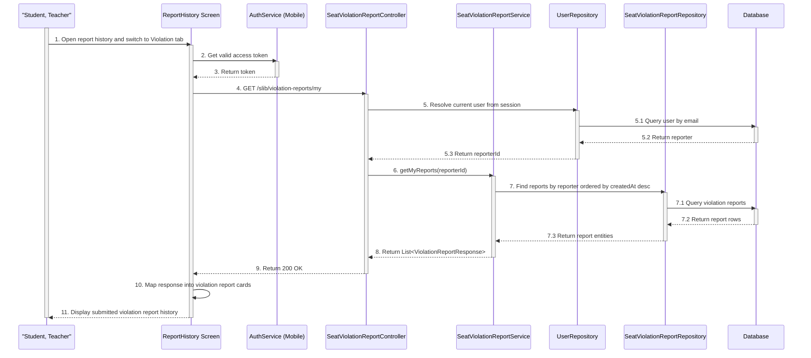

# FE-99 View History of Sending Report Seat Violation

```mermaid
sequenceDiagram
    participant Users as "Student, Teacher"
    participant ReportHistory as ReportHistory Screen
    participant AuthService as AuthService (Mobile)
    participant ViolationController as SeatViolationReportController
    participant ViolationService as SeatViolationReportService
    participant UserRepo as UserRepository
    participant ReportRepo as SeatViolationReportRepository
    participant DB as Database

    activate Users
    Users->>ReportHistory: 1. Open report history and switch to Violation tab
    activate ReportHistory
    ReportHistory->>AuthService: 2. Get valid access token
    activate AuthService
    AuthService-->>ReportHistory: 3. Return token
    deactivate AuthService
    ReportHistory->>ViolationController: 4. GET /slib/violation-reports/my
    activate ViolationController
    ViolationController->>UserRepo: 5. Resolve current user from session
    activate UserRepo
    UserRepo->>DB: 5.1 Query user by email
    activate DB
    DB-->>UserRepo: 5.2 Return reporter
    deactivate DB
    UserRepo-->>ViolationController: 5.3 Return reporterId
    deactivate UserRepo
    ViolationController->>ViolationService: 6. getMyReports(reporterId)
    activate ViolationService
    ViolationService->>ReportRepo: 7. Find reports by reporter ordered by createdAt desc
    activate ReportRepo
    ReportRepo->>DB: 7.1 Query violation reports
    activate DB
    DB-->>ReportRepo: 7.2 Return report rows
    deactivate DB
    ReportRepo-->>ViolationService: 7.3 Return report entities
    deactivate ReportRepo
    ViolationService-->>ViolationController: 8. Return List<ViolationReportResponse>
    deactivate ViolationService
    ViolationController-->>ReportHistory: 9. Return 200 OK
    deactivate ViolationController
    ReportHistory->>ReportHistory: 10. Map response into violation report cards
    ReportHistory-->>Users: 11. Display submitted violation report history
    deactivate ReportHistory
    deactivate Users
```

