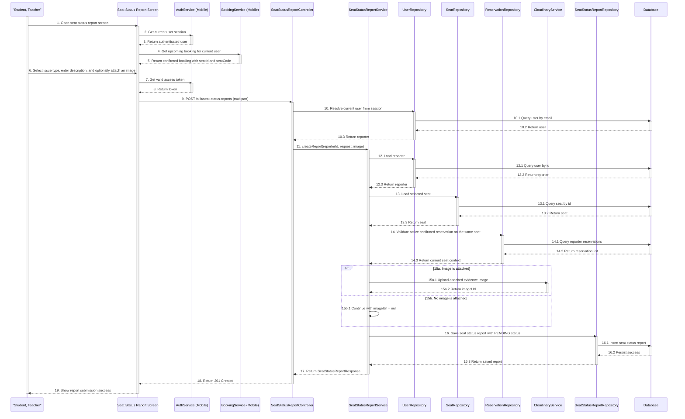

# FE-89 Create Seat Status Report

```mermaid
sequenceDiagram
    participant Users as "Student, Teacher"
    participant SeatStatusScreen as Seat Status Report Screen
    participant AuthService as AuthService (Mobile)
    participant BookingService as BookingService (Mobile)
    participant SeatStatusController as SeatStatusReportController
    participant SeatStatusService as SeatStatusReportService
    participant UserRepo as UserRepository
    participant SeatRepo as SeatRepository
    participant ReservationRepo as ReservationRepository
    participant Cloudinary as CloudinaryService
    participant ReportRepo as SeatStatusReportRepository
    participant DB as Database

    activate Users
    Users->>SeatStatusScreen: 1. Open seat status report screen
    activate SeatStatusScreen
    SeatStatusScreen->>AuthService: 2. Get current user session
    activate AuthService
    AuthService-->>SeatStatusScreen: 3. Return authenticated user
    deactivate AuthService
    SeatStatusScreen->>BookingService: 4. Get upcoming booking for current user
    activate BookingService
    BookingService-->>SeatStatusScreen: 5. Return confirmed booking with seatId and seatCode
    deactivate BookingService
    Users->>SeatStatusScreen: 6. Select issue type, enter description, and optionally attach an image
    SeatStatusScreen->>AuthService: 7. Get valid access token
    activate AuthService
    AuthService-->>SeatStatusScreen: 8. Return token
    deactivate AuthService
    SeatStatusScreen->>SeatStatusController: 9. POST /slib/seat-status-reports (multipart)
    activate SeatStatusController
    SeatStatusController->>UserRepo: 10. Resolve current user from session
    activate UserRepo
    UserRepo->>DB: 10.1 Query user by email
    activate DB
    DB-->>UserRepo: 10.2 Return user
    deactivate DB
    UserRepo-->>SeatStatusController: 10.3 Return reporter
    deactivate UserRepo
    SeatStatusController->>SeatStatusService: 11. createReport(reporterId, request, image)
    activate SeatStatusService
    SeatStatusService->>UserRepo: 12. Load reporter
    activate UserRepo
    UserRepo->>DB: 12.1 Query user by id
    activate DB
    DB-->>UserRepo: 12.2 Return reporter
    deactivate DB
    UserRepo-->>SeatStatusService: 12.3 Return reporter
    deactivate UserRepo
    SeatStatusService->>SeatRepo: 13. Load selected seat
    activate SeatRepo
    SeatRepo->>DB: 13.1 Query seat by id
    activate DB
    DB-->>SeatRepo: 13.2 Return seat
    deactivate DB
    SeatRepo-->>SeatStatusService: 13.3 Return seat
    deactivate SeatRepo
    SeatStatusService->>ReservationRepo: 14. Validate active confirmed reservation on the same seat
    activate ReservationRepo
    ReservationRepo->>DB: 14.1 Query reporter reservations
    activate DB
    DB-->>ReservationRepo: 14.2 Return reservation list
    deactivate DB
    ReservationRepo-->>SeatStatusService: 14.3 Return current seat context
    deactivate ReservationRepo

    alt 15a. Image is attached
        SeatStatusService->>Cloudinary: 15a.1 Upload attached evidence image
        activate Cloudinary
        Cloudinary-->>SeatStatusService: 15a.2 Return imageUrl
        deactivate Cloudinary
    else 15b. No image is attached
        SeatStatusService->>SeatStatusService: 15b.1 Continue with imageUrl = null
    end

    SeatStatusService->>ReportRepo: 16. Save seat status report with PENDING status
    activate ReportRepo
    ReportRepo->>DB: 16.1 Insert seat status report
    activate DB
    DB-->>ReportRepo: 16.2 Persist success
    deactivate DB
    ReportRepo-->>SeatStatusService: 16.3 Return saved report
    deactivate ReportRepo
    SeatStatusService-->>SeatStatusController: 17. Return SeatStatusReportResponse
    deactivate SeatStatusService
    SeatStatusController-->>SeatStatusScreen: 18. Return 201 Created
    deactivate SeatStatusController
    SeatStatusScreen-->>Users: 19. Show report submission success
    deactivate SeatStatusScreen
    deactivate Users
```
