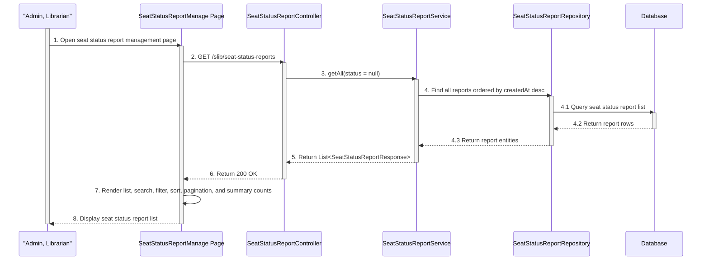

# FE-91 View List of Seat Status Reports

```mermaid
sequenceDiagram
    participant Staff as "Admin, Librarian"
    participant SeatStatusManage as SeatStatusReportManage Page
    participant SeatStatusController as SeatStatusReportController
    participant SeatStatusService as SeatStatusReportService
    participant ReportRepo as SeatStatusReportRepository
    participant DB as Database

    activate Staff
    Staff->>SeatStatusManage: 1. Open seat status report management page
    activate SeatStatusManage
    SeatStatusManage->>SeatStatusController: 2. GET /slib/seat-status-reports
    activate SeatStatusController
    SeatStatusController->>SeatStatusService: 3. getAll(status = null)
    activate SeatStatusService
    SeatStatusService->>ReportRepo: 4. Find all reports ordered by createdAt desc
    activate ReportRepo
    ReportRepo->>DB: 4.1 Query seat status report list
    activate DB
    DB-->>ReportRepo: 4.2 Return report rows
    deactivate DB
    ReportRepo-->>SeatStatusService: 4.3 Return report entities
    deactivate ReportRepo
    SeatStatusService-->>SeatStatusController: 5. Return List<SeatStatusReportResponse>
    deactivate SeatStatusService
    SeatStatusController-->>SeatStatusManage: 6. Return 200 OK
    deactivate SeatStatusController
    SeatStatusManage->>SeatStatusManage: 7. Render list, search, filter, sort, pagination, and summary counts
    SeatStatusManage-->>Staff: 8. Display seat status report list
    deactivate SeatStatusManage
    deactivate Staff
```
