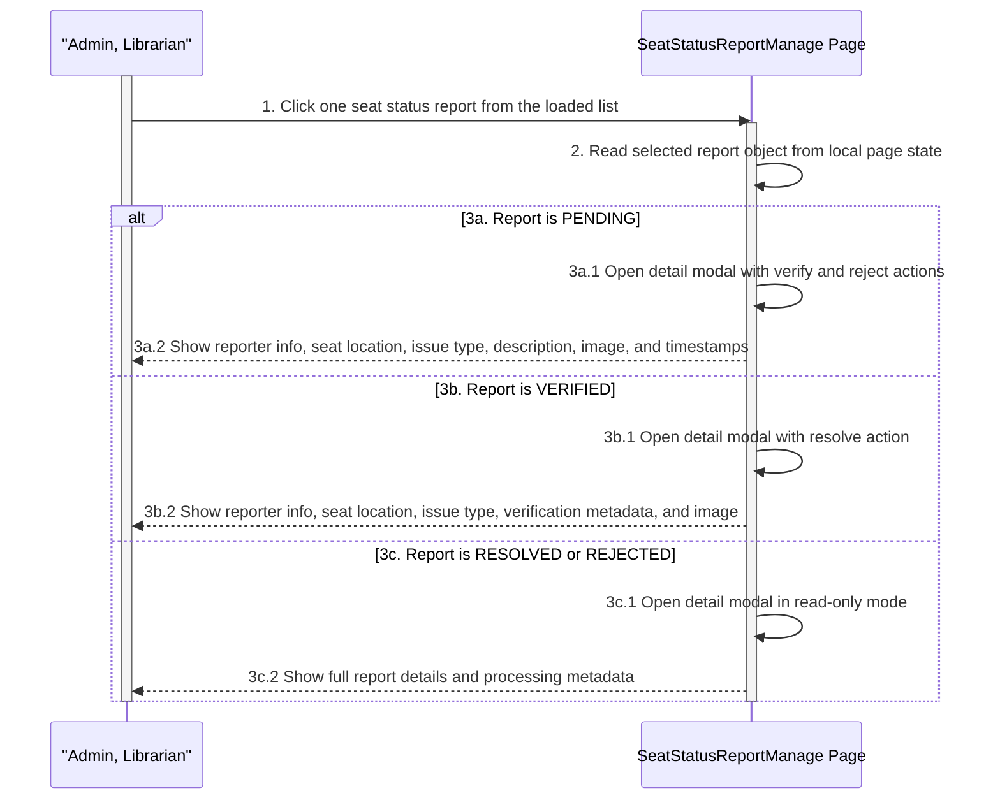

# FE-92 View Seat Status Report Details

```mermaid
sequenceDiagram
    participant Staff as "Admin, Librarian"
    participant SeatStatusManage as SeatStatusReportManage Page

    activate Staff
    Staff->>SeatStatusManage: 1. Click one seat status report from the loaded list
    activate SeatStatusManage
    SeatStatusManage->>SeatStatusManage: 2. Read selected report object from local page state

    alt 3a. Report is PENDING
        SeatStatusManage->>SeatStatusManage: 3a.1 Open detail modal with verify and reject actions
        SeatStatusManage-->>Staff: 3a.2 Show reporter info, seat location, issue type, description, image, and timestamps
    else 3b. Report is VERIFIED
        SeatStatusManage->>SeatStatusManage: 3b.1 Open detail modal with resolve action
        SeatStatusManage-->>Staff: 3b.2 Show reporter info, seat location, issue type, verification metadata, and image
    else 3c. Report is RESOLVED or REJECTED
        SeatStatusManage->>SeatStatusManage: 3c.1 Open detail modal in read-only mode
        SeatStatusManage-->>Staff: 3c.2 Show full report details and processing metadata
    end

    deactivate SeatStatusManage
    deactivate Staff
```
