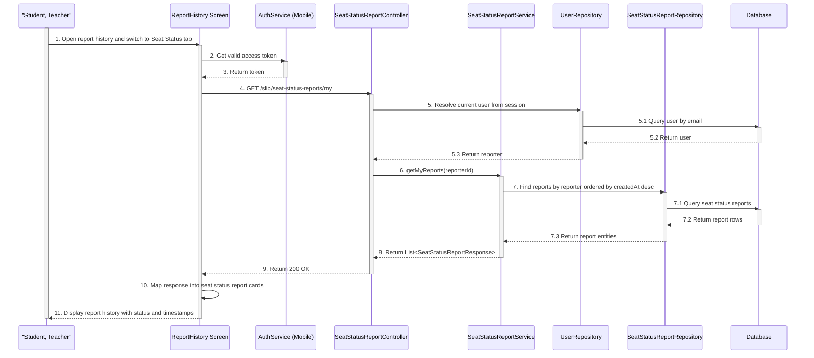

# FE-94 View History of Sending Seat Status Report

```mermaid
sequenceDiagram
    participant Users as "Student, Teacher"
    participant ReportHistory as ReportHistory Screen
    participant AuthService as AuthService (Mobile)
    participant SeatStatusController as SeatStatusReportController
    participant SeatStatusService as SeatStatusReportService
    participant UserRepo as UserRepository
    participant ReportRepo as SeatStatusReportRepository
    participant DB as Database

    activate Users
    Users->>ReportHistory: 1. Open report history and switch to Seat Status tab
    activate ReportHistory
    ReportHistory->>AuthService: 2. Get valid access token
    activate AuthService
    AuthService-->>ReportHistory: 3. Return token
    deactivate AuthService
    ReportHistory->>SeatStatusController: 4. GET /slib/seat-status-reports/my
    activate SeatStatusController
    SeatStatusController->>UserRepo: 5. Resolve current user from session
    activate UserRepo
    UserRepo->>DB: 5.1 Query user by email
    activate DB
    DB-->>UserRepo: 5.2 Return user
    deactivate DB
    UserRepo-->>SeatStatusController: 5.3 Return reporter
    deactivate UserRepo
    SeatStatusController->>SeatStatusService: 6. getMyReports(reporterId)
    activate SeatStatusService
    SeatStatusService->>ReportRepo: 7. Find reports by reporter ordered by createdAt desc
    activate ReportRepo
    ReportRepo->>DB: 7.1 Query seat status reports
    activate DB
    DB-->>ReportRepo: 7.2 Return report rows
    deactivate DB
    ReportRepo-->>SeatStatusService: 7.3 Return report entities
    deactivate ReportRepo
    SeatStatusService-->>SeatStatusController: 8. Return List<SeatStatusReportResponse>
    deactivate SeatStatusService
    SeatStatusController-->>ReportHistory: 9. Return 200 OK
    deactivate SeatStatusController
    ReportHistory->>ReportHistory: 10. Map response into seat status report cards
    ReportHistory-->>Users: 11. Display report history with status and timestamps
    deactivate ReportHistory
    deactivate Users
```

