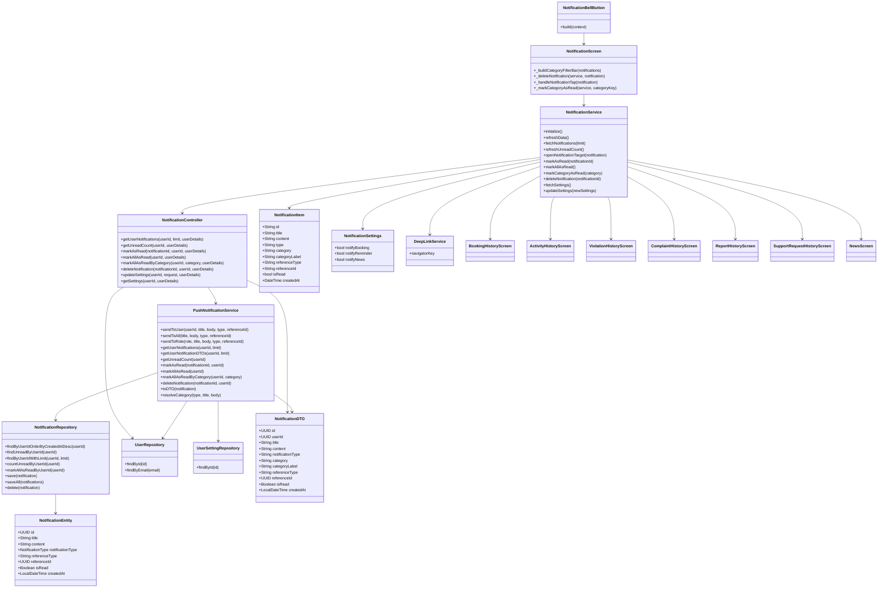

# Notification Module Class Diagram

```mermaid
classDiagram
    class NotificationController {
        +getUserNotifications(userId, limit, userDetails)
        +getUnreadCount(userId, userDetails)
        +markAsRead(notificationId, userId, userDetails)
        +markAllAsRead(userId, userDetails)
        +markAllAsReadByCategory(userId, category, userDetails)
        +deleteNotification(notificationId, userId, userDetails)
        +updateSettings(userId, request, userDetails)
        +getSettings(userId, userDetails)
    }

    class PushNotificationService {
        +sendToUser(userId, title, body, type, referenceId)
        +sendToAll(title, body, type, referenceId)
        +sendToRole(role, title, body, type, referenceId)
        +getUserNotifications(userId, limit)
        +getUserNotificationDTOs(userId, limit)
        +getUnreadCount(userId)
        +markAsRead(notificationId, userId)
        +markAllAsRead(userId)
        +markAllAsReadByCategory(userId, category)
        +deleteNotification(notificationId, userId)
        +toDTO(notification)
        +resolveCategory(type, title, body)
    }

    class NotificationRepository {
        +findByUserIdOrderByCreatedAtDesc(userId)
        +findUnreadByUserId(userId)
        +findByUserIdWithLimit(userId, limit)
        +countUnreadByUserId(userId)
        +markAllAsReadByUserId(userId)
        +save(notification)
        +saveAll(notifications)
        +delete(notification)
    }

    class UserRepository {
        +findById(id)
        +findByEmail(email)
    }

    class UserSettingRepository {
        +findById(id)
    }

    class NotificationEntity {
        +UUID id
        +String title
        +String content
        +NotificationType notificationType
        +String referenceType
        +UUID referenceId
        +Boolean isRead
        +LocalDateTime createdAt
    }

    class NotificationDTO {
        +UUID id
        +UUID userId
        +String title
        +String content
        +String notificationType
        +String category
        +String categoryLabel
        +String referenceType
        +UUID referenceId
        +Boolean isRead
        +LocalDateTime createdAt
    }

    class NotificationService {
        +initialize()
        +refreshData()
        +fetchNotifications(limit)
        +refreshUnreadCount()
        +openNotificationTarget(notification)
        +markAsRead(notificationId)
        +markAllAsRead()
        +markCategoryAsRead(category)
        +deleteNotification(notificationId)
        +fetchSettings()
        +updateSettings(newSettings)
    }

    class NotificationItem {
        +String id
        +String title
        +String content
        +String type
        +String category
        +String categoryLabel
        +String referenceType
        +String referenceId
        +bool isRead
        +DateTime createdAt
    }

    class NotificationSettings {
        +bool notifyBooking
        +bool notifyReminder
        +bool notifyNews
    }

    class NotificationScreen {
        +_buildCategoryFilterBar(notifications)
        +_deleteNotification(service, notification)
        +_handleNotificationTap(notification)
        +_markCategoryAsRead(service, categoryKey)
    }

    class NotificationBellButton {
        +build(context)
    }

    class DeepLinkService {
        +navigatorKey
    }

    class BookingHistoryScreen
    class ActivityHistoryScreen
    class ViolationHistoryScreen
    class ComplaintHistoryScreen
    class ReportHistoryScreen
    class SupportRequestHistoryScreen
    class NewsScreen

    NotificationController --> PushNotificationService
    NotificationController --> UserRepository
    PushNotificationService --> NotificationRepository
    PushNotificationService --> UserRepository
    PushNotificationService --> UserSettingRepository
    NotificationRepository --> NotificationEntity
    NotificationController --> NotificationDTO
    PushNotificationService --> NotificationDTO

    NotificationService --> NotificationController
    NotificationService --> NotificationItem
    NotificationService --> NotificationSettings
    NotificationScreen --> NotificationService
    NotificationBellButton --> NotificationScreen

    NotificationService --> DeepLinkService
    NotificationService --> BookingHistoryScreen
    NotificationService --> ActivityHistoryScreen
    NotificationService --> ViolationHistoryScreen
    NotificationService --> ComplaintHistoryScreen
    NotificationService --> ReportHistoryScreen
    NotificationService --> SupportRequestHistoryScreen
    NotificationService --> NewsScreen
```
