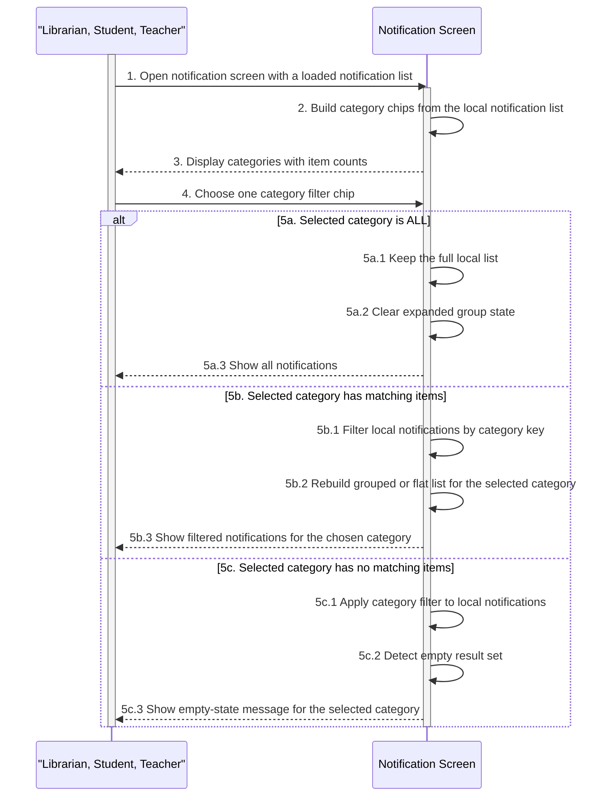

# FE-101 Filter Notification

```mermaid
sequenceDiagram
    participant Users as "Librarian, Student, Teacher"
    participant NotificationScreen as Notification Screen

    activate Users
    Users->>NotificationScreen: 1. Open notification screen with a loaded notification list
    activate NotificationScreen
    NotificationScreen->>NotificationScreen: 2. Build category chips from the local notification list
    NotificationScreen-->>Users: 3. Display categories with item counts
    Users->>NotificationScreen: 4. Choose one category filter chip

    alt 5a. Selected category is ALL
        NotificationScreen->>NotificationScreen: 5a.1 Keep the full local list
        NotificationScreen->>NotificationScreen: 5a.2 Clear expanded group state
        NotificationScreen-->>Users: 5a.3 Show all notifications
    else 5b. Selected category has matching items
        NotificationScreen->>NotificationScreen: 5b.1 Filter local notifications by category key
        NotificationScreen->>NotificationScreen: 5b.2 Rebuild grouped or flat list for the selected category
        NotificationScreen-->>Users: 5b.3 Show filtered notifications for the chosen category
    else 5c. Selected category has no matching items
        NotificationScreen->>NotificationScreen: 5c.1 Apply category filter to local notifications
        NotificationScreen->>NotificationScreen: 5c.2 Detect empty result set
        NotificationScreen-->>Users: 5c.3 Show empty-state message for the selected category
    end

    deactivate NotificationScreen
    deactivate Users
```
