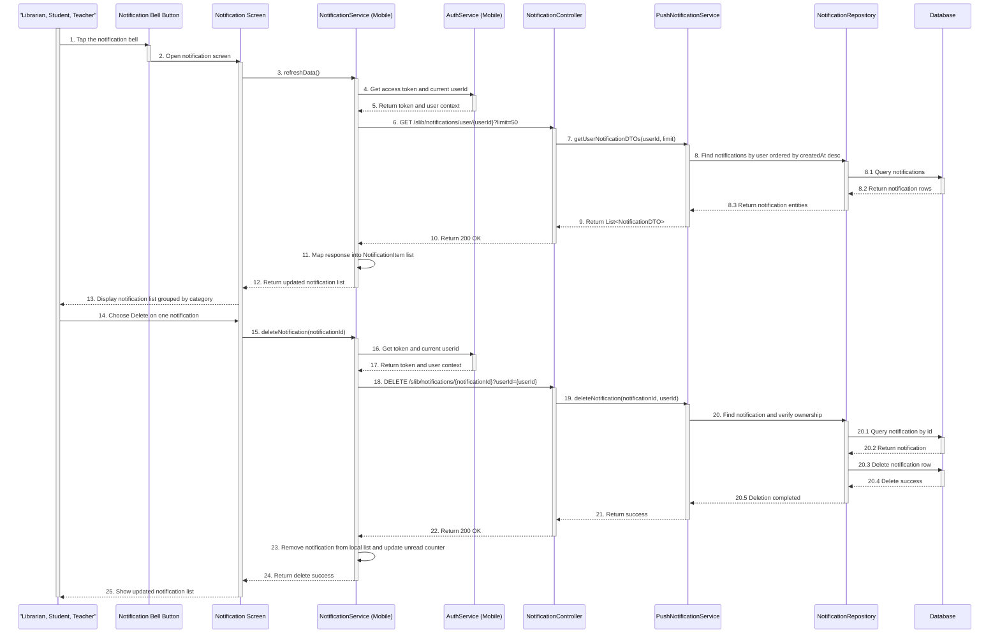

# FE-103 View and Delete List of Notifications

```mermaid
sequenceDiagram
    participant Users as "Librarian, Student, Teacher"
    participant BellButton as Notification Bell Button
    participant NotificationScreen as Notification Screen
    participant MobileNotiService as NotificationService (Mobile)
    participant AuthService as AuthService (Mobile)
    participant NotificationController as NotificationController
    participant PushService as PushNotificationService
    participant NotificationRepo as NotificationRepository
    participant DB as Database

    activate Users
    Users->>BellButton: 1. Tap the notification bell
    activate BellButton
    BellButton->>NotificationScreen: 2. Open notification screen
    deactivate BellButton
    activate NotificationScreen
    NotificationScreen->>MobileNotiService: 3. refreshData()
    activate MobileNotiService
    MobileNotiService->>AuthService: 4. Get access token and current userId
    activate AuthService
    AuthService-->>MobileNotiService: 5. Return token and user context
    deactivate AuthService
    MobileNotiService->>NotificationController: 6. GET /slib/notifications/user/{userId}?limit=50
    activate NotificationController
    NotificationController->>PushService: 7. getUserNotificationDTOs(userId, limit)
    activate PushService
    PushService->>NotificationRepo: 8. Find notifications by user ordered by createdAt desc
    activate NotificationRepo
    NotificationRepo->>DB: 8.1 Query notifications
    activate DB
    DB-->>NotificationRepo: 8.2 Return notification rows
    deactivate DB
    NotificationRepo-->>PushService: 8.3 Return notification entities
    deactivate NotificationRepo
    PushService-->>NotificationController: 9. Return List<NotificationDTO>
    deactivate PushService
    NotificationController-->>MobileNotiService: 10. Return 200 OK
    deactivate NotificationController
    MobileNotiService->>MobileNotiService: 11. Map response into NotificationItem list
    MobileNotiService-->>NotificationScreen: 12. Return updated notification list
    deactivate MobileNotiService
    NotificationScreen-->>Users: 13. Display notification list grouped by category

    Users->>NotificationScreen: 14. Choose Delete on one notification
    NotificationScreen->>MobileNotiService: 15. deleteNotification(notificationId)
    activate MobileNotiService
    MobileNotiService->>AuthService: 16. Get token and current userId
    activate AuthService
    AuthService-->>MobileNotiService: 17. Return token and user context
    deactivate AuthService
    MobileNotiService->>NotificationController: 18. DELETE /slib/notifications/{notificationId}?userId={userId}
    activate NotificationController
    NotificationController->>PushService: 19. deleteNotification(notificationId, userId)
    activate PushService
    PushService->>NotificationRepo: 20. Find notification and verify ownership
    activate NotificationRepo
    NotificationRepo->>DB: 20.1 Query notification by id
    activate DB
    DB-->>NotificationRepo: 20.2 Return notification
    deactivate DB
    NotificationRepo->>DB: 20.3 Delete notification row
    activate DB
    DB-->>NotificationRepo: 20.4 Delete success
    deactivate DB
    NotificationRepo-->>PushService: 20.5 Deletion completed
    deactivate NotificationRepo
    PushService-->>NotificationController: 21. Return success
    deactivate PushService
    NotificationController-->>MobileNotiService: 22. Return 200 OK
    deactivate NotificationController
    MobileNotiService->>MobileNotiService: 23. Remove notification from local list and update unread counter
    MobileNotiService-->>NotificationScreen: 24. Return delete success
    deactivate MobileNotiService
    NotificationScreen-->>Users: 25. Show updated notification list
    deactivate NotificationScreen
    deactivate Users
```

