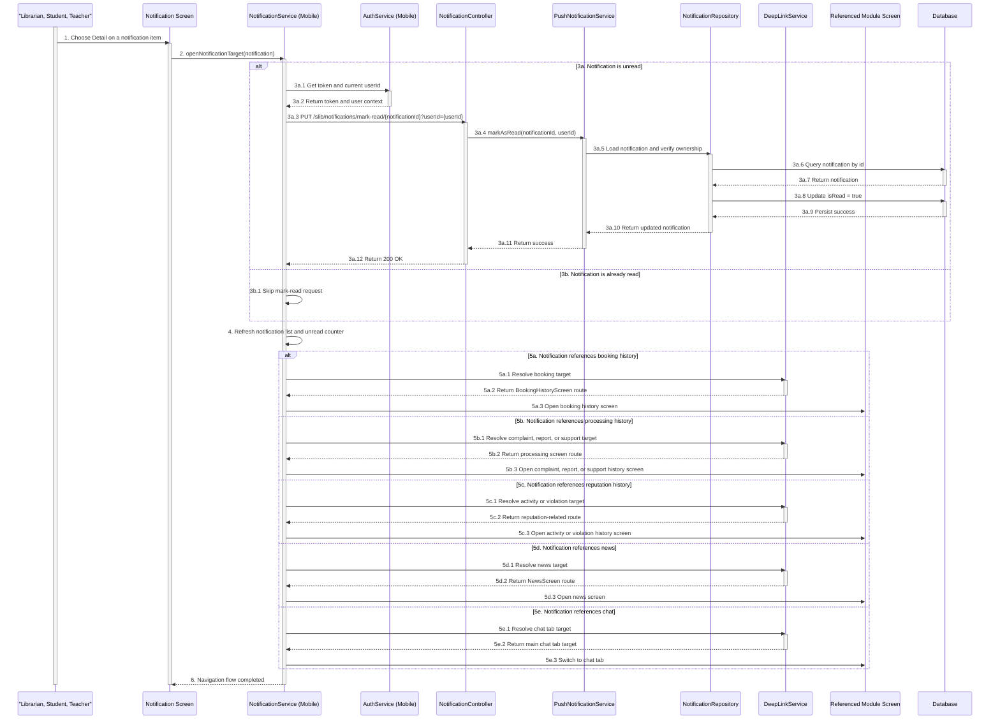

# FE-104 View Notification Details

```mermaid
sequenceDiagram
    participant Users as "Librarian, Student, Teacher"
    participant NotificationScreen as Notification Screen
    participant MobileNotiService as NotificationService (Mobile)
    participant AuthService as AuthService (Mobile)
    participant NotificationController as NotificationController
    participant PushService as PushNotificationService
    participant NotificationRepo as NotificationRepository
    participant DeepLinkService as DeepLinkService
    participant TargetScreen as Referenced Module Screen
    participant DB as Database

    activate Users
    Users->>NotificationScreen: 1. Choose Detail on a notification item
    activate NotificationScreen
    NotificationScreen->>MobileNotiService: 2. openNotificationTarget(notification)
    activate MobileNotiService

    alt 3a. Notification is unread
        MobileNotiService->>AuthService: 3a.1 Get token and current userId
        activate AuthService
        AuthService-->>MobileNotiService: 3a.2 Return token and user context
        deactivate AuthService
        MobileNotiService->>NotificationController: 3a.3 PUT /slib/notifications/mark-read/{notificationId}?userId={userId}
        activate NotificationController
        NotificationController->>PushService: 3a.4 markAsRead(notificationId, userId)
        activate PushService
        PushService->>NotificationRepo: 3a.5 Load notification and verify ownership
        activate NotificationRepo
        NotificationRepo->>DB: 3a.6 Query notification by id
        activate DB
        DB-->>NotificationRepo: 3a.7 Return notification
        deactivate DB
        NotificationRepo->>DB: 3a.8 Update isRead = true
        activate DB
        DB-->>NotificationRepo: 3a.9 Persist success
        deactivate DB
        NotificationRepo-->>PushService: 3a.10 Return updated notification
        deactivate NotificationRepo
        PushService-->>NotificationController: 3a.11 Return success
        deactivate PushService
        NotificationController-->>MobileNotiService: 3a.12 Return 200 OK
        deactivate NotificationController
    else 3b. Notification is already read
        MobileNotiService->>MobileNotiService: 3b.1 Skip mark-read request
    end

    MobileNotiService->>MobileNotiService: 4. Refresh notification list and unread counter

    alt 5a. Notification references booking history
        MobileNotiService->>DeepLinkService: 5a.1 Resolve booking target
        activate DeepLinkService
        DeepLinkService-->>MobileNotiService: 5a.2 Return BookingHistoryScreen route
        deactivate DeepLinkService
        MobileNotiService->>TargetScreen: 5a.3 Open booking history screen
    else 5b. Notification references processing history
        MobileNotiService->>DeepLinkService: 5b.1 Resolve complaint, report, or support target
        activate DeepLinkService
        DeepLinkService-->>MobileNotiService: 5b.2 Return processing screen route
        deactivate DeepLinkService
        MobileNotiService->>TargetScreen: 5b.3 Open complaint, report, or support history screen
    else 5c. Notification references reputation history
        MobileNotiService->>DeepLinkService: 5c.1 Resolve activity or violation target
        activate DeepLinkService
        DeepLinkService-->>MobileNotiService: 5c.2 Return reputation-related route
        deactivate DeepLinkService
        MobileNotiService->>TargetScreen: 5c.3 Open activity or violation history screen
    else 5d. Notification references news
        MobileNotiService->>DeepLinkService: 5d.1 Resolve news target
        activate DeepLinkService
        DeepLinkService-->>MobileNotiService: 5d.2 Return NewsScreen route
        deactivate DeepLinkService
        MobileNotiService->>TargetScreen: 5d.3 Open news screen
    else 5e. Notification references chat
        MobileNotiService->>DeepLinkService: 5e.1 Resolve chat tab target
        activate DeepLinkService
        DeepLinkService-->>MobileNotiService: 5e.2 Return main chat tab target
        deactivate DeepLinkService
        MobileNotiService->>TargetScreen: 5e.3 Switch to chat tab
    end

    MobileNotiService-->>NotificationScreen: 6. Navigation flow completed
    deactivate MobileNotiService
    deactivate NotificationScreen
    deactivate Users
```

