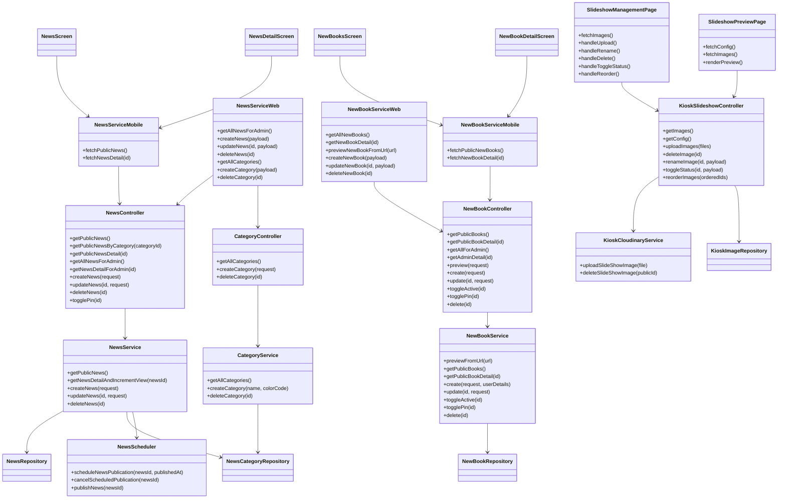

# News & Announcement Module Class Diagram

```mermaid
classDiagram
    class NewsController {
        +getPublicNews()
        +getPublicNewsByCategory(categoryId)
        +getPublicNewsDetail(id)
        +getAllNewsForAdmin()
        +getNewsDetailForAdmin(id)
        +createNews(request)
        +updateNews(id, request)
        +deleteNews(id)
        +togglePin(id)
    }

    class CategoryController {
        +getAllCategories()
        +createCategory(request)
        +deleteCategory(id)
    }

    class NewBookController {
        +getPublicBooks()
        +getPublicBookDetail(id)
        +getAllForAdmin()
        +getAdminDetail(id)
        +preview(request)
        +create(request)
        +update(id, request)
        +toggleActive(id)
        +togglePin(id)
        +delete(id)
    }

    class KioskSlideshowController {
        +getImages()
        +getConfig()
        +uploadImages(files)
        +deleteImage(id)
        +renameImage(id, payload)
        +toggleStatus(id, payload)
        +reorderImages(orderedIds)
    }

    class NewsService {
        +getPublicNews()
        +getNewsDetailAndIncrementView(newsId)
        +createNews(request)
        +updateNews(id, request)
        +deleteNews(id)
    }

    class CategoryService {
        +getAllCategories()
        +createCategory(name, colorCode)
        +deleteCategory(id)
    }

    class NewBookService {
        +previewFromUrl(url)
        +getPublicBooks()
        +getPublicBookDetail(id)
        +create(request, userDetails)
        +update(id, request)
        +toggleActive(id)
        +togglePin(id)
        +delete(id)
    }

    class NewsScheduler {
        +scheduleNewsPublication(newsId, publishedAt)
        +cancelScheduledPublication(newsId)
        +publishNews(newsId)
    }

    class KioskCloudinaryService {
        +uploadSlideShowImage(file)
        +deleteSlideShowImage(publicId)
    }

    class NewsRepository
    class NewsCategoryRepository
    class NewBookRepository
    class KioskImageRepository

    class NewsServiceWeb {
        +getAllNewsForAdmin()
        +createNews(payload)
        +updateNews(id, payload)
        +deleteNews(id)
        +getAllCategories()
        +createCategory(payload)
        +deleteCategory(id)
    }

    class NewBookServiceWeb {
        +getAllNewBooks()
        +getNewBookDetail(id)
        +previewNewBookFromUrl(url)
        +createNewBook(payload)
        +updateNewBook(id, payload)
        +deleteNewBook(id)
    }

    class NewsServiceMobile {
        +fetchPublicNews()
        +fetchNewsDetail(id)
    }

    class NewBookServiceMobile {
        +fetchPublicNewBooks()
        +fetchNewBookDetail(id)
    }

    class SlideshowManagementPage {
        +fetchImages()
        +handleUpload()
        +handleRename()
        +handleDelete()
        +handleToggleStatus()
        +handleReorder()
    }

    class SlideshowPreviewPage {
        +fetchConfig()
        +fetchImages()
        +renderPreview()
    }

    class NewsScreen
    class NewsDetailScreen
    class NewBooksScreen
    class NewBookDetailScreen

    NewsController --> NewsService
    CategoryController --> CategoryService
    NewBookController --> NewBookService
    KioskSlideshowController --> KioskCloudinaryService
    KioskSlideshowController --> KioskImageRepository
    NewsService --> NewsRepository
    NewsService --> NewsCategoryRepository
    NewsService --> NewsScheduler
    CategoryService --> NewsCategoryRepository
    NewBookService --> NewBookRepository
    NewsServiceWeb --> NewsController
    NewsServiceWeb --> CategoryController
    NewBookServiceWeb --> NewBookController
    NewsServiceMobile --> NewsController
    NewBookServiceMobile --> NewBookController
    SlideshowManagementPage --> KioskSlideshowController
    SlideshowPreviewPage --> KioskSlideshowController
    NewsScreen --> NewsServiceMobile
    NewsDetailScreen --> NewsServiceMobile
    NewBooksScreen --> NewBookServiceMobile
    NewBookDetailScreen --> NewBookServiceMobile
```
