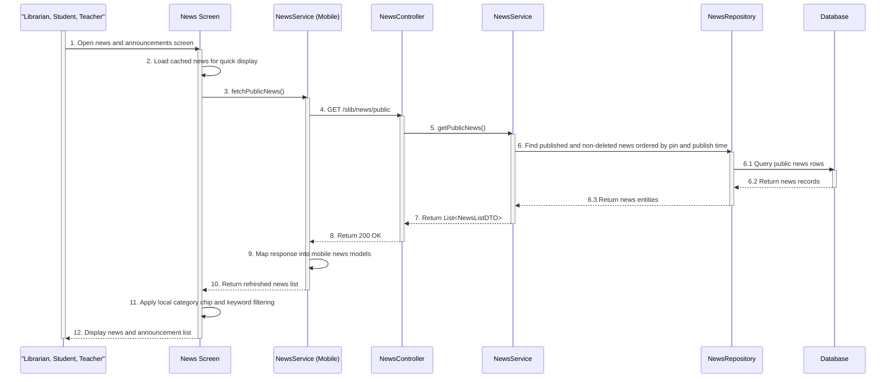

# FE-103 View List of News & Announcements

```mermaid
sequenceDiagram
    participant Users as "Librarian, Student, Teacher"
    participant NewsScreen as News Screen
    participant MobileNewsService as NewsService (Mobile)
    participant NewsController as NewsController
    participant NewsService as NewsService
    participant NewsRepo as NewsRepository
    participant DB as Database

    activate Users
    Users->>NewsScreen: 1. Open news and announcements screen
    activate NewsScreen
    NewsScreen->>NewsScreen: 2. Load cached news for quick display
    NewsScreen->>MobileNewsService: 3. fetchPublicNews()
    activate MobileNewsService
    MobileNewsService->>NewsController: 4. GET /slib/news/public
    activate NewsController
    NewsController->>NewsService: 5. getPublicNews()
    activate NewsService
    NewsService->>NewsRepo: 6. Find published and non-deleted news ordered by pin and publish time
    activate NewsRepo
    NewsRepo->>DB: 6.1 Query public news rows
    activate DB
    DB-->>NewsRepo: 6.2 Return news records
    deactivate DB
    NewsRepo-->>NewsService: 6.3 Return news entities
    deactivate NewsRepo
    NewsService-->>NewsController: 7. Return List<NewsListDTO>
    deactivate NewsService
    NewsController-->>MobileNewsService: 8. Return 200 OK
    deactivate NewsController
    MobileNewsService->>MobileNewsService: 9. Map response into mobile news models
    MobileNewsService-->>NewsScreen: 10. Return refreshed news list
    deactivate MobileNewsService
    NewsScreen->>NewsScreen: 11. Apply local category chip and keyword filtering
    NewsScreen-->>Users: 12. Display news and announcement list
    deactivate NewsScreen
    deactivate Users
```
