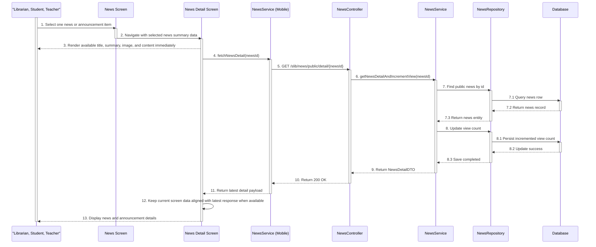

# FE-104 View News & Announcement Details

```mermaid
sequenceDiagram
    participant Users as "Librarian, Student, Teacher"
    participant NewsScreen as News Screen
    participant NewsDetailScreen as News Detail Screen
    participant MobileNewsService as NewsService (Mobile)
    participant NewsController as NewsController
    participant NewsService as NewsService
    participant NewsRepo as NewsRepository
    participant DB as Database

    activate Users
    Users->>NewsScreen: 1. Select one news or announcement item
    activate NewsScreen
    NewsScreen->>NewsDetailScreen: 2. Navigate with selected news summary data
    deactivate NewsScreen
    activate NewsDetailScreen
    NewsDetailScreen-->>Users: 3. Render available title, summary, image, and content immediately
    NewsDetailScreen->>MobileNewsService: 4. fetchNewsDetail(newsId)
    activate MobileNewsService
    MobileNewsService->>NewsController: 5. GET /slib/news/public/detail/{newsId}
    activate NewsController
    NewsController->>NewsService: 6. getNewsDetailAndIncrementView(newsId)
    activate NewsService
    NewsService->>NewsRepo: 7. Find public news by id
    activate NewsRepo
    NewsRepo->>DB: 7.1 Query news row
    activate DB
    DB-->>NewsRepo: 7.2 Return news record
    deactivate DB
    NewsRepo-->>NewsService: 7.3 Return news entity
    deactivate NewsRepo
    NewsService->>NewsRepo: 8. Update view count
    activate NewsRepo
    NewsRepo->>DB: 8.1 Persist incremented view count
    activate DB
    DB-->>NewsRepo: 8.2 Update success
    deactivate DB
    NewsRepo-->>NewsService: 8.3 Save completed
    deactivate NewsRepo
    NewsService-->>NewsController: 9. Return NewsDetailDTO
    deactivate NewsService
    NewsController-->>MobileNewsService: 10. Return 200 OK
    deactivate NewsController
    MobileNewsService-->>NewsDetailScreen: 11. Return latest detail payload
    deactivate MobileNewsService
    NewsDetailScreen->>NewsDetailScreen: 12. Keep current screen data aligned with latest response when available
    NewsDetailScreen-->>Users: 13. Display news and announcement details
    deactivate NewsDetailScreen
    deactivate Users
```
