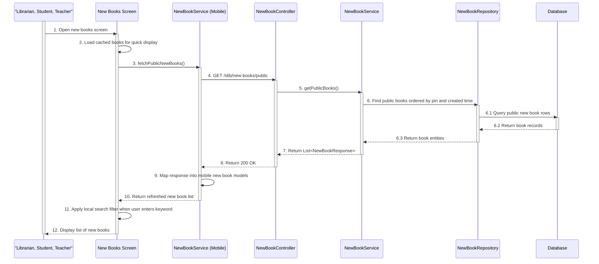

# FE-106 View List of New Books

```mermaid
sequenceDiagram
    participant Users as "Librarian, Student, Teacher"
    participant NewBooksScreen as New Books Screen
    participant MobileBookService as NewBookService (Mobile)
    participant NewBookController as NewBookController
    participant NewBookService as NewBookService
    participant NewBookRepo as NewBookRepository
    participant DB as Database

    activate Users
    Users->>NewBooksScreen: 1. Open new books screen
    activate NewBooksScreen
    NewBooksScreen->>NewBooksScreen: 2. Load cached books for quick display
    NewBooksScreen->>MobileBookService: 3. fetchPublicNewBooks()
    activate MobileBookService
    MobileBookService->>NewBookController: 4. GET /slib/new-books/public
    activate NewBookController
    NewBookController->>NewBookService: 5. getPublicBooks()
    activate NewBookService
    NewBookService->>NewBookRepo: 6. Find public books ordered by pin and created time
    activate NewBookRepo
    NewBookRepo->>DB: 6.1 Query public new book rows
    activate DB
    DB-->>NewBookRepo: 6.2 Return book records
    deactivate DB
    NewBookRepo-->>NewBookService: 6.3 Return book entities
    deactivate NewBookRepo
    NewBookService-->>NewBookController: 7. Return List<NewBookResponse>
    deactivate NewBookService
    NewBookController-->>MobileBookService: 8. Return 200 OK
    deactivate NewBookController
    MobileBookService->>MobileBookService: 9. Map response into mobile new book models
    MobileBookService-->>NewBooksScreen: 10. Return refreshed new book list
    deactivate MobileBookService
    NewBooksScreen->>NewBooksScreen: 11. Apply local search filter when user enters keyword
    NewBooksScreen-->>Users: 12. Display list of new books
    deactivate NewBooksScreen
    deactivate Users
```
