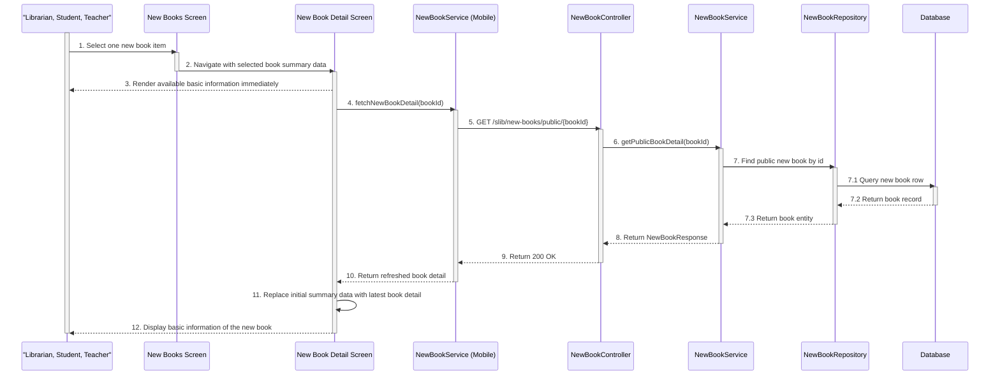

# FE-107 View Basic Information of New Book

```mermaid
sequenceDiagram
    participant Users as "Librarian, Student, Teacher"
    participant NewBooksScreen as New Books Screen
    participant BookDetailScreen as New Book Detail Screen
    participant MobileBookService as NewBookService (Mobile)
    participant NewBookController as NewBookController
    participant NewBookService as NewBookService
    participant NewBookRepo as NewBookRepository
    participant DB as Database

    activate Users
    Users->>NewBooksScreen: 1. Select one new book item
    activate NewBooksScreen
    NewBooksScreen->>BookDetailScreen: 2. Navigate with selected book summary data
    deactivate NewBooksScreen
    activate BookDetailScreen
    BookDetailScreen-->>Users: 3. Render available basic information immediately
    BookDetailScreen->>MobileBookService: 4. fetchNewBookDetail(bookId)
    activate MobileBookService
    MobileBookService->>NewBookController: 5. GET /slib/new-books/public/{bookId}
    activate NewBookController
    NewBookController->>NewBookService: 6. getPublicBookDetail(bookId)
    activate NewBookService
    NewBookService->>NewBookRepo: 7. Find public new book by id
    activate NewBookRepo
    NewBookRepo->>DB: 7.1 Query new book row
    activate DB
    DB-->>NewBookRepo: 7.2 Return book record
    deactivate DB
    NewBookRepo-->>NewBookService: 7.3 Return book entity
    deactivate NewBookRepo
    NewBookService-->>NewBookController: 8. Return NewBookResponse
    deactivate NewBookService
    NewBookController-->>MobileBookService: 9. Return 200 OK
    deactivate NewBookController
    MobileBookService-->>BookDetailScreen: 10. Return refreshed book detail
    deactivate MobileBookService
    BookDetailScreen->>BookDetailScreen: 11. Replace initial summary data with latest book detail
    BookDetailScreen-->>Users: 12. Display basic information of the new book
    deactivate BookDetailScreen
    deactivate Users
```
