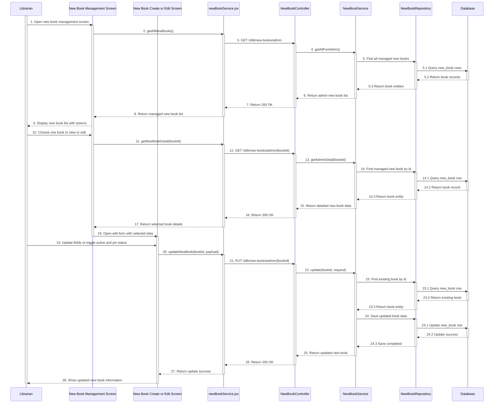

# FE-108a View and Update New Book

```mermaid
sequenceDiagram
    participant Librarian as Librarian
    participant BookManagePage as New Book Management Screen
    participant BookForm as New Book Create or Edit Screen
    participant BookWebService as newBookService.jsx
    participant NewBookController as NewBookController
    participant NewBookService as NewBookService
    participant NewBookRepo as NewBookRepository
    participant DB as Database

    activate Librarian
    Librarian->>BookManagePage: 1. Open new book management screen
    activate BookManagePage
    BookManagePage->>BookWebService: 2. getAllNewBooks()
    activate BookWebService
    BookWebService->>NewBookController: 3. GET /slib/new-books/admin
    activate NewBookController
    NewBookController->>NewBookService: 4. getAllForAdmin()
    activate NewBookService
    NewBookService->>NewBookRepo: 5. Find all managed new books
    activate NewBookRepo
    NewBookRepo->>DB: 5.1 Query new_book rows
    activate DB
    DB-->>NewBookRepo: 5.2 Return book records
    deactivate DB
    NewBookRepo-->>NewBookService: 5.3 Return book entities
    deactivate NewBookRepo
    NewBookService-->>NewBookController: 6. Return admin new book list
    deactivate NewBookService
    NewBookController-->>BookWebService: 7. Return 200 OK
    deactivate NewBookController
    BookWebService-->>BookManagePage: 8. Return managed new book list
    deactivate BookWebService
    BookManagePage-->>Librarian: 9. Display new book list with actions

    Librarian->>BookManagePage: 10. Choose one book to view or edit
    BookManagePage->>BookWebService: 11. getNewBookDetail(bookId)
    activate BookWebService
    BookWebService->>NewBookController: 12. GET /slib/new-books/admin/{bookId}
    activate NewBookController
    NewBookController->>NewBookService: 13. getAdminDetail(bookId)
    activate NewBookService
    NewBookService->>NewBookRepo: 14. Find managed new book by id
    activate NewBookRepo
    NewBookRepo->>DB: 14.1 Query new_book row
    activate DB
    DB-->>NewBookRepo: 14.2 Return book record
    deactivate DB
    NewBookRepo-->>NewBookService: 14.3 Return book entity
    deactivate NewBookRepo
    NewBookService-->>NewBookController: 15. Return detailed new book data
    deactivate NewBookService
    NewBookController-->>BookWebService: 16. Return 200 OK
    deactivate NewBookController
    BookWebService-->>BookManagePage: 17. Return selected book details
    deactivate BookWebService
    BookManagePage->>BookForm: 18. Open edit form with selected data
    deactivate BookManagePage
    activate BookForm
    Librarian->>BookForm: 19. Update fields or toggle active and pin status
    BookForm->>BookWebService: 20. updateNewBook(bookId, payload)
    activate BookWebService
    BookWebService->>NewBookController: 21. PUT /slib/new-books/admin/{bookId}
    activate NewBookController
    NewBookController->>NewBookService: 22. update(bookId, request)
    activate NewBookService
    NewBookService->>NewBookRepo: 23. Find existing book by id
    activate NewBookRepo
    NewBookRepo->>DB: 23.1 Query new_book row
    activate DB
    DB-->>NewBookRepo: 23.2 Return existing book
    deactivate DB
    NewBookRepo-->>NewBookService: 23.3 Return book entity
    deactivate NewBookRepo
    NewBookService->>NewBookRepo: 24. Save updated book data
    activate NewBookRepo
    NewBookRepo->>DB: 24.1 Update new_book row
    activate DB
    DB-->>NewBookRepo: 24.2 Update success
    deactivate DB
    NewBookRepo-->>NewBookService: 24.3 Save completed
    deactivate NewBookRepo
    NewBookService-->>NewBookController: 25. Return updated new book
    deactivate NewBookService
    NewBookController-->>BookWebService: 26. Return 200 OK
    deactivate NewBookController
    BookWebService-->>BookForm: 27. Return update success
    deactivate BookWebService
    BookForm-->>Librarian: 28. Show updated new book information
    deactivate BookForm
    deactivate Librarian
```
