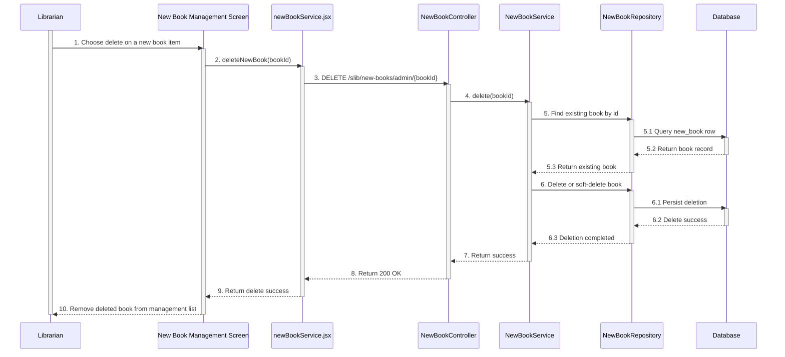

# FE-108c Delete New Book

```mermaid
sequenceDiagram
    participant Librarian as Librarian
    participant BookManagePage as New Book Management Screen
    participant BookWebService as newBookService.jsx
    participant NewBookController as NewBookController
    participant NewBookService as NewBookService
    participant NewBookRepo as NewBookRepository
    participant DB as Database

    activate Librarian
    Librarian->>BookManagePage: 1. Choose delete on a new book item
    activate BookManagePage
    BookManagePage->>BookWebService: 2. deleteNewBook(bookId)
    activate BookWebService
    BookWebService->>NewBookController: 3. DELETE /slib/new-books/admin/{bookId}
    activate NewBookController
    NewBookController->>NewBookService: 4. delete(bookId)
    activate NewBookService
    NewBookService->>NewBookRepo: 5. Find existing book by id
    activate NewBookRepo
    NewBookRepo->>DB: 5.1 Query new_book row
    activate DB
    DB-->>NewBookRepo: 5.2 Return book record
    deactivate DB
    NewBookRepo-->>NewBookService: 5.3 Return existing book
    deactivate NewBookRepo
    NewBookService->>NewBookRepo: 6. Delete or soft-delete book
    activate NewBookRepo
    NewBookRepo->>DB: 6.1 Persist deletion
    activate DB
    DB-->>NewBookRepo: 6.2 Delete success
    deactivate DB
    NewBookRepo-->>NewBookService: 6.3 Deletion completed
    deactivate NewBookRepo
    NewBookService-->>NewBookController: 7. Return success
    deactivate NewBookService
    NewBookController-->>BookWebService: 8. Return 200 OK
    deactivate NewBookController
    BookWebService-->>BookManagePage: 9. Return delete success
    deactivate BookWebService
    BookManagePage-->>Librarian: 10. Remove deleted book from management list
    deactivate BookManagePage
    deactivate Librarian
```
