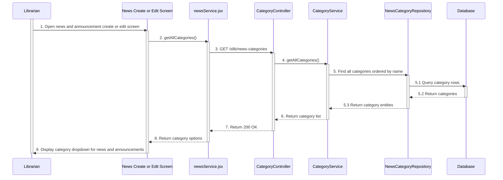

# FE-109 View List of News & Announcement Categories

```mermaid
sequenceDiagram
    participant Librarian as Librarian
    participant NewsForm as News Create or Edit Screen
    participant NewsWebService as newsService.jsx
    participant CategoryController as CategoryController
    participant CategoryService as CategoryService
    participant CategoryRepo as NewsCategoryRepository
    participant DB as Database

    activate Librarian
    Librarian->>NewsForm: 1. Open news and announcement create or edit screen
    activate NewsForm
    NewsForm->>NewsWebService: 2. getAllCategories()
    activate NewsWebService
    NewsWebService->>CategoryController: 3. GET /slib/news-categories
    activate CategoryController
    CategoryController->>CategoryService: 4. getAllCategories()
    activate CategoryService
    CategoryService->>CategoryRepo: 5. Find all categories ordered by name
    activate CategoryRepo
    CategoryRepo->>DB: 5.1 Query category rows
    activate DB
    DB-->>CategoryRepo: 5.2 Return categories
    deactivate DB
    CategoryRepo-->>CategoryService: 5.3 Return category entities
    deactivate CategoryRepo
    CategoryService-->>CategoryController: 6. Return category list
    deactivate CategoryService
    CategoryController-->>NewsWebService: 7. Return 200 OK
    deactivate CategoryController
    NewsWebService-->>NewsForm: 8. Return category options
    deactivate NewsWebService
    NewsForm-->>Librarian: 9. Display category dropdown for news and announcements
    deactivate NewsForm
    deactivate Librarian
```

