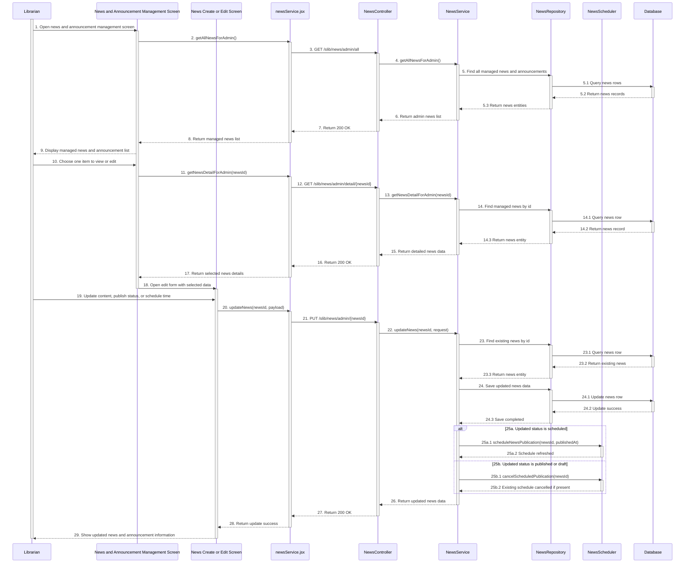

# FE-109a View and Update News & Announcement

```mermaid
sequenceDiagram
    participant Librarian as Librarian
    participant NewsManagePage as News and Announcement Management Screen
    participant NewsForm as News Create or Edit Screen
    participant NewsWebService as newsService.jsx
    participant NewsController as NewsController
    participant NewsService as NewsService
    participant NewsRepo as NewsRepository
    participant Scheduler as NewsScheduler
    participant DB as Database

    activate Librarian
    Librarian->>NewsManagePage: 1. Open news and announcement management screen
    activate NewsManagePage
    NewsManagePage->>NewsWebService: 2. getAllNewsForAdmin()
    activate NewsWebService
    NewsWebService->>NewsController: 3. GET /slib/news/admin/all
    activate NewsController
    NewsController->>NewsService: 4. getAllNewsForAdmin()
    activate NewsService
    NewsService->>NewsRepo: 5. Find all managed news and announcements
    activate NewsRepo
    NewsRepo->>DB: 5.1 Query news rows
    activate DB
    DB-->>NewsRepo: 5.2 Return news records
    deactivate DB
    NewsRepo-->>NewsService: 5.3 Return news entities
    deactivate NewsRepo
    NewsService-->>NewsController: 6. Return admin news list
    deactivate NewsService
    NewsController-->>NewsWebService: 7. Return 200 OK
    deactivate NewsController
    NewsWebService-->>NewsManagePage: 8. Return managed news list
    deactivate NewsWebService
    NewsManagePage-->>Librarian: 9. Display managed news and announcement list

    Librarian->>NewsManagePage: 10. Choose one item to view or edit
    NewsManagePage->>NewsWebService: 11. getNewsDetailForAdmin(newsId)
    activate NewsWebService
    NewsWebService->>NewsController: 12. GET /slib/news/admin/detail/{newsId}
    activate NewsController
    NewsController->>NewsService: 13. getNewsDetailForAdmin(newsId)
    activate NewsService
    NewsService->>NewsRepo: 14. Find managed news by id
    activate NewsRepo
    NewsRepo->>DB: 14.1 Query news row
    activate DB
    DB-->>NewsRepo: 14.2 Return news record
    deactivate DB
    NewsRepo-->>NewsService: 14.3 Return news entity
    deactivate NewsRepo
    NewsService-->>NewsController: 15. Return detailed news data
    deactivate NewsService
    NewsController-->>NewsWebService: 16. Return 200 OK
    deactivate NewsController
    NewsWebService-->>NewsManagePage: 17. Return selected news details
    deactivate NewsWebService
    NewsManagePage->>NewsForm: 18. Open edit form with selected data
    deactivate NewsManagePage
    activate NewsForm
    Librarian->>NewsForm: 19. Update content, publish status, or schedule time
    NewsForm->>NewsWebService: 20. updateNews(newsId, payload)
    activate NewsWebService
    NewsWebService->>NewsController: 21. PUT /slib/news/admin/{newsId}
    activate NewsController
    NewsController->>NewsService: 22. updateNews(newsId, request)
    activate NewsService
    NewsService->>NewsRepo: 23. Find existing news by id
    activate NewsRepo
    NewsRepo->>DB: 23.1 Query news row
    activate DB
    DB-->>NewsRepo: 23.2 Return existing news
    deactivate DB
    NewsRepo-->>NewsService: 23.3 Return news entity
    deactivate NewsRepo
    NewsService->>NewsRepo: 24. Save updated news data
    activate NewsRepo
    NewsRepo->>DB: 24.1 Update news row
    activate DB
    DB-->>NewsRepo: 24.2 Update success
    deactivate DB
    NewsRepo-->>NewsService: 24.3 Save completed
    deactivate NewsRepo
    alt 25a. Updated status is scheduled
        NewsService->>Scheduler: 25a.1 scheduleNewsPublication(newsId, publishedAt)
        activate Scheduler
        Scheduler-->>NewsService: 25a.2 Schedule refreshed
        deactivate Scheduler
    else 25b. Updated status is published or draft
        NewsService->>Scheduler: 25b.1 cancelScheduledPublication(newsId)
        activate Scheduler
        Scheduler-->>NewsService: 25b.2 Existing schedule cancelled if present
        deactivate Scheduler
    end
    NewsService-->>NewsController: 26. Return updated news data
    deactivate NewsService
    NewsController-->>NewsWebService: 27. Return 200 OK
    deactivate NewsController
    NewsWebService-->>NewsForm: 28. Return update success
    deactivate NewsWebService
    NewsForm-->>Librarian: 29. Show updated news and announcement information
    deactivate NewsForm
    deactivate Librarian
```
