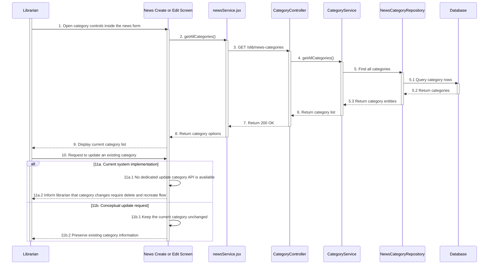

# FE-110a View and Update News & Announcement Category

```mermaid
sequenceDiagram
    participant Librarian as Librarian
    participant NewsForm as News Create or Edit Screen
    participant NewsWebService as newsService.jsx
    participant CategoryController as CategoryController
    participant CategoryService as CategoryService
    participant CategoryRepo as NewsCategoryRepository
    participant DB as Database

    activate Librarian
    Librarian->>NewsForm: 1. Open category controls inside the news form
    activate NewsForm
    NewsForm->>NewsWebService: 2. getAllCategories()
    activate NewsWebService
    NewsWebService->>CategoryController: 3. GET /slib/news-categories
    activate CategoryController
    CategoryController->>CategoryService: 4. getAllCategories()
    activate CategoryService
    CategoryService->>CategoryRepo: 5. Find all categories
    activate CategoryRepo
    CategoryRepo->>DB: 5.1 Query category rows
    activate DB
    DB-->>CategoryRepo: 5.2 Return categories
    deactivate DB
    CategoryRepo-->>CategoryService: 5.3 Return category entities
    deactivate CategoryRepo
    CategoryService-->>CategoryController: 6. Return category list
    deactivate CategoryService
    CategoryController-->>NewsWebService: 7. Return 200 OK
    deactivate CategoryController
    NewsWebService-->>NewsForm: 8. Return category options
    deactivate NewsWebService
    NewsForm-->>Librarian: 9. Display current category list

    Librarian->>NewsForm: 10. Request to update an existing category
    alt 11a. Current system implementation
        NewsForm->>NewsForm: 11a.1 No dedicated update category API is available
        NewsForm-->>Librarian: 11a.2 Inform librarian that category changes require delete and recreate flow
    else 11b. Conceptual update request
        NewsForm->>NewsForm: 11b.1 Keep the current category unchanged
        NewsForm-->>Librarian: 11b.2 Preserve existing category information
    end
    deactivate NewsForm
    deactivate Librarian
```
