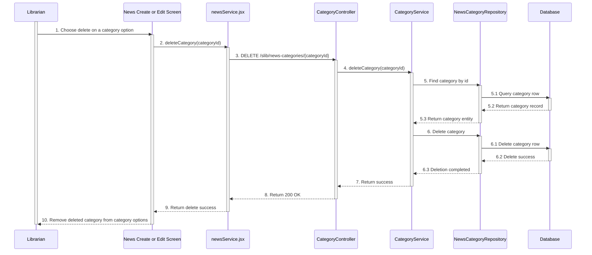

# FE-110c Delete News & Announcement Category

```mermaid
sequenceDiagram
    participant Librarian as Librarian
    participant NewsForm as News Create or Edit Screen
    participant NewsWebService as newsService.jsx
    participant CategoryController as CategoryController
    participant CategoryService as CategoryService
    participant CategoryRepo as NewsCategoryRepository
    participant DB as Database

    activate Librarian
    Librarian->>NewsForm: 1. Choose delete on a category option
    activate NewsForm
    NewsForm->>NewsWebService: 2. deleteCategory(categoryId)
    activate NewsWebService
    NewsWebService->>CategoryController: 3. DELETE /slib/news-categories/{categoryId}
    activate CategoryController
    CategoryController->>CategoryService: 4. deleteCategory(categoryId)
    activate CategoryService
    CategoryService->>CategoryRepo: 5. Find category by id
    activate CategoryRepo
    CategoryRepo->>DB: 5.1 Query category row
    activate DB
    DB-->>CategoryRepo: 5.2 Return category record
    deactivate DB
    CategoryRepo-->>CategoryService: 5.3 Return category entity
    deactivate CategoryRepo
    CategoryService->>CategoryRepo: 6. Delete category
    activate CategoryRepo
    CategoryRepo->>DB: 6.1 Delete category row
    activate DB
    DB-->>CategoryRepo: 6.2 Delete success
    deactivate DB
    CategoryRepo-->>CategoryService: 6.3 Deletion completed
    deactivate CategoryRepo
    CategoryService-->>CategoryController: 7. Return success
    deactivate CategoryService
    CategoryController-->>NewsWebService: 8. Return 200 OK
    deactivate CategoryController
    NewsWebService-->>NewsForm: 9. Return delete success
    deactivate NewsWebService
    NewsForm-->>Librarian: 10. Remove deleted category from category options
    deactivate NewsForm
    deactivate Librarian
```
