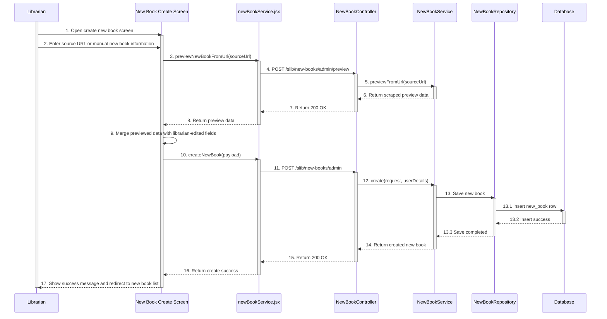

# FE-112b Create New Book

```mermaid
sequenceDiagram
    participant Librarian as Librarian
    participant BookForm as New Book Create Screen
    participant BookWebService as newBookService.jsx
    participant NewBookController as NewBookController
    participant NewBookService as NewBookService
    participant NewBookRepo as NewBookRepository
    participant DB as Database

    activate Librarian
    Librarian->>BookForm: 1. Open create new book screen
    activate BookForm
    Librarian->>BookForm: 2. Enter source URL or manual new book information
    BookForm->>BookWebService: 3. previewNewBookFromUrl(sourceUrl)
    activate BookWebService
    BookWebService->>NewBookController: 4. POST /slib/new-books/admin/preview
    activate NewBookController
    NewBookController->>NewBookService: 5. previewFromUrl(sourceUrl)
    activate NewBookService
    NewBookService-->>NewBookController: 6. Return scraped preview data
    deactivate NewBookService
    NewBookController-->>BookWebService: 7. Return 200 OK
    deactivate NewBookController
    BookWebService-->>BookForm: 8. Return preview data
    deactivate BookWebService
    BookForm->>BookForm: 9. Merge previewed data with librarian-edited fields
    BookForm->>BookWebService: 10. createNewBook(payload)
    activate BookWebService
    BookWebService->>NewBookController: 11. POST /slib/new-books/admin
    activate NewBookController
    NewBookController->>NewBookService: 12. create(request, userDetails)
    activate NewBookService
    NewBookService->>NewBookRepo: 13. Save new book
    activate NewBookRepo
    NewBookRepo->>DB: 13.1 Insert new_book row
    activate DB
    DB-->>NewBookRepo: 13.2 Insert success
    deactivate DB
    NewBookRepo-->>NewBookService: 13.3 Save completed
    deactivate NewBookRepo
    NewBookService-->>NewBookController: 14. Return created new book
    deactivate NewBookService
    NewBookController-->>BookWebService: 15. Return 200 OK
    deactivate NewBookController
    BookWebService-->>BookForm: 16. Return create success
    deactivate BookWebService
    BookForm-->>Librarian: 17. Show success message and redirect to new book list
    deactivate BookForm
    deactivate Librarian
```

