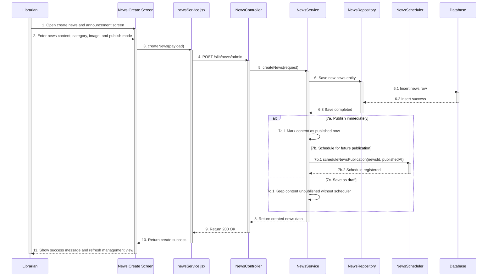

# FE-113b Create News & Announcement

```mermaid
sequenceDiagram
    participant Librarian as Librarian
    participant NewsForm as News Create Screen
    participant NewsWebService as newsService.jsx
    participant NewsController as NewsController
    participant NewsService as NewsService
    participant NewsRepo as NewsRepository
    participant Scheduler as NewsScheduler
    participant DB as Database

    activate Librarian
    Librarian->>NewsForm: 1. Open create news and announcement screen
    activate NewsForm
    Librarian->>NewsForm: 2. Enter news content, category, image, and publish mode
    NewsForm->>NewsWebService: 3. createNews(payload)
    activate NewsWebService
    NewsWebService->>NewsController: 4. POST /slib/news/admin
    activate NewsController
    NewsController->>NewsService: 5. createNews(request)
    activate NewsService
    NewsService->>NewsRepo: 6. Save new news entity
    activate NewsRepo
    NewsRepo->>DB: 6.1 Insert news row
    activate DB
    DB-->>NewsRepo: 6.2 Insert success
    deactivate DB
    NewsRepo-->>NewsService: 6.3 Save completed
    deactivate NewsRepo
    alt 7a. Publish immediately
        NewsService->>NewsService: 7a.1 Mark content as published now
    else 7b. Schedule for future publication
        NewsService->>Scheduler: 7b.1 scheduleNewsPublication(newsId, publishedAt)
        activate Scheduler
        Scheduler-->>NewsService: 7b.2 Schedule registered
        deactivate Scheduler
    else 7c. Save as draft
        NewsService->>NewsService: 7c.1 Keep content unpublished without scheduler
    end
    NewsService-->>NewsController: 8. Return created news data
    deactivate NewsService
    NewsController-->>NewsWebService: 9. Return 200 OK
    deactivate NewsController
    NewsWebService-->>NewsForm: 10. Return create success
    deactivate NewsWebService
    NewsForm-->>Librarian: 11. Show success message and refresh management view
    deactivate NewsForm
    deactivate Librarian
```

