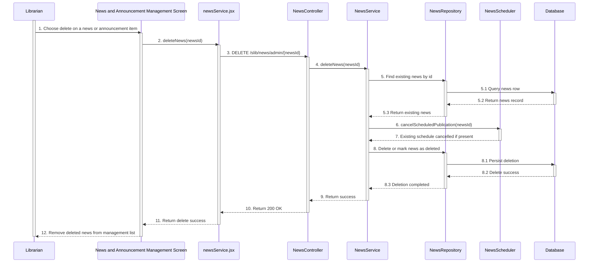

# FE-113c Delete News & Announcement

```mermaid
sequenceDiagram
    participant Librarian as Librarian
    participant NewsManagePage as News and Announcement Management Screen
    participant NewsWebService as newsService.jsx
    participant NewsController as NewsController
    participant NewsService as NewsService
    participant NewsRepo as NewsRepository
    participant Scheduler as NewsScheduler
    participant DB as Database

    activate Librarian
    Librarian->>NewsManagePage: 1. Choose delete on a news or announcement item
    activate NewsManagePage
    NewsManagePage->>NewsWebService: 2. deleteNews(newsId)
    activate NewsWebService
    NewsWebService->>NewsController: 3. DELETE /slib/news/admin/{newsId}
    activate NewsController
    NewsController->>NewsService: 4. deleteNews(newsId)
    activate NewsService
    NewsService->>NewsRepo: 5. Find existing news by id
    activate NewsRepo
    NewsRepo->>DB: 5.1 Query news row
    activate DB
    DB-->>NewsRepo: 5.2 Return news record
    deactivate DB
    NewsRepo-->>NewsService: 5.3 Return existing news
    deactivate NewsRepo
    NewsService->>Scheduler: 6. cancelScheduledPublication(newsId)
    activate Scheduler
    Scheduler-->>NewsService: 7. Existing schedule cancelled if present
    deactivate Scheduler
    NewsService->>NewsRepo: 8. Delete or mark news as deleted
    activate NewsRepo
    NewsRepo->>DB: 8.1 Persist deletion
    activate DB
    DB-->>NewsRepo: 8.2 Delete success
    deactivate DB
    NewsRepo-->>NewsService: 8.3 Deletion completed
    deactivate NewsRepo
    NewsService-->>NewsController: 9. Return success
    deactivate NewsService
    NewsController-->>NewsWebService: 10. Return 200 OK
    deactivate NewsController
    NewsWebService-->>NewsManagePage: 11. Return delete success
    deactivate NewsWebService
    NewsManagePage-->>Librarian: 12. Remove deleted news from management list
    deactivate NewsManagePage
    deactivate Librarian
```

