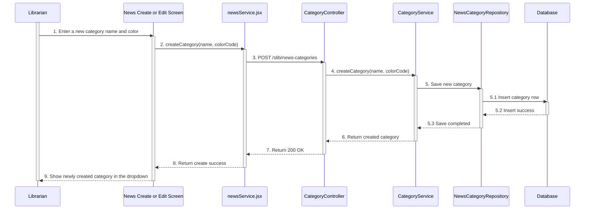

# FE-114 Create News & Announcement Category

```mermaid
sequenceDiagram
    participant Librarian as Librarian
    participant NewsForm as News Create or Edit Screen
    participant NewsWebService as newsService.jsx
    participant CategoryController as CategoryController
    participant CategoryService as CategoryService
    participant CategoryRepo as NewsCategoryRepository
    participant DB as Database

    activate Librarian
    Librarian->>NewsForm: 1. Enter a new category name and color
    activate NewsForm
    NewsForm->>NewsWebService: 2. createCategory(name, colorCode)
    activate NewsWebService
    NewsWebService->>CategoryController: 3. POST /slib/news-categories
    activate CategoryController
    CategoryController->>CategoryService: 4. createCategory(name, colorCode)
    activate CategoryService
    CategoryService->>CategoryRepo: 5. Save new category
    activate CategoryRepo
    CategoryRepo->>DB: 5.1 Insert category row
    activate DB
    DB-->>CategoryRepo: 5.2 Insert success
    deactivate DB
    CategoryRepo-->>CategoryService: 5.3 Save completed
    deactivate CategoryRepo
    CategoryService-->>CategoryController: 6. Return created category
    deactivate CategoryService
    CategoryController-->>NewsWebService: 7. Return 200 OK
    deactivate CategoryController
    NewsWebService-->>NewsForm: 8. Return create success
    deactivate NewsWebService
    NewsForm-->>Librarian: 9. Show newly created category in the dropdown
    deactivate NewsForm
    deactivate Librarian
```

