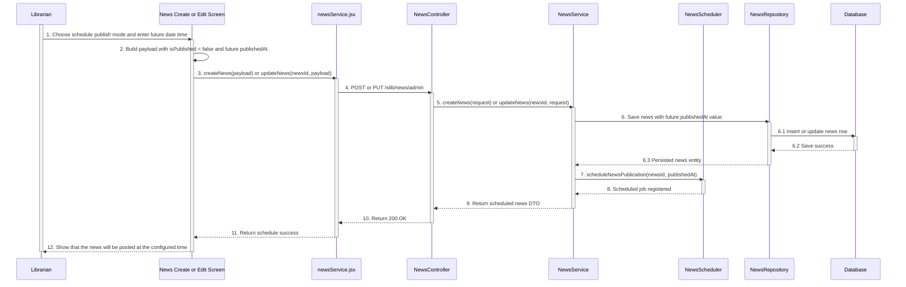

# FE-115 Set Time to Post News & Announcement

```mermaid
sequenceDiagram
    participant Librarian as Librarian
    participant NewsForm as News Create or Edit Screen
    participant NewsWebService as newsService.jsx
    participant NewsController as NewsController
    participant NewsService as NewsService
    participant Scheduler as NewsScheduler
    participant NewsRepo as NewsRepository
    participant DB as Database

    activate Librarian
    Librarian->>NewsForm: 1. Choose schedule publish mode and enter future date time
    activate NewsForm
    NewsForm->>NewsForm: 2. Build payload with isPublished = false and future publishedAt
    NewsForm->>NewsWebService: 3. createNews(payload) or updateNews(newsId, payload)
    activate NewsWebService
    NewsWebService->>NewsController: 4. POST or PUT /slib/news/admin
    activate NewsController
    NewsController->>NewsService: 5. createNews(request) or updateNews(newsId, request)
    activate NewsService
    NewsService->>NewsRepo: 6. Save news with future publishedAt value
    activate NewsRepo
    NewsRepo->>DB: 6.1 Insert or update news row
    activate DB
    DB-->>NewsRepo: 6.2 Save success
    deactivate DB
    NewsRepo-->>NewsService: 6.3 Persisted news entity
    deactivate NewsRepo
    NewsService->>Scheduler: 7. scheduleNewsPublication(newsId, publishedAt)
    activate Scheduler
    Scheduler-->>NewsService: 8. Scheduled job registered
    deactivate Scheduler
    NewsService-->>NewsController: 9. Return scheduled news DTO
    deactivate NewsService
    NewsController-->>NewsWebService: 10. Return 200 OK
    deactivate NewsController
    NewsWebService-->>NewsForm: 11. Return schedule success
    deactivate NewsWebService
    NewsForm-->>Librarian: 12. Show that the news will be posted at the configured time
    deactivate NewsForm
    deactivate Librarian
```

