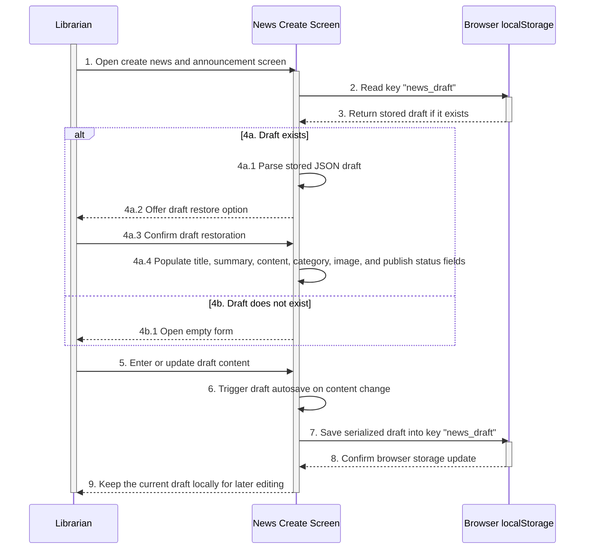

# FE-116 Save News & Announcement Draft

```mermaid
sequenceDiagram
    participant Librarian as Librarian
    participant NewsForm as News Create Screen
    participant BrowserStorage as Browser localStorage

    activate Librarian
    Librarian->>NewsForm: 1. Open create news and announcement screen
    activate NewsForm
    NewsForm->>BrowserStorage: 2. Read key "news_draft"
    activate BrowserStorage
    BrowserStorage-->>NewsForm: 3. Return stored draft if it exists
    deactivate BrowserStorage

    alt 4a. Draft exists
        NewsForm->>NewsForm: 4a.1 Parse stored JSON draft
        NewsForm-->>Librarian: 4a.2 Offer draft restore option
        Librarian->>NewsForm: 4a.3 Confirm draft restoration
        NewsForm->>NewsForm: 4a.4 Populate title, summary, content, category, image, and publish status fields
    else 4b. Draft does not exist
        NewsForm-->>Librarian: 4b.1 Open empty form
    end

    Librarian->>NewsForm: 5. Enter or update draft content
    NewsForm->>NewsForm: 6. Trigger draft autosave on content change
    NewsForm->>BrowserStorage: 7. Save serialized draft into key "news_draft"
    activate BrowserStorage
    BrowserStorage-->>NewsForm: 8. Confirm browser storage update
    deactivate BrowserStorage
    NewsForm-->>Librarian: 9. Keep the current draft locally for later editing
    deactivate NewsForm
    deactivate Librarian
```

