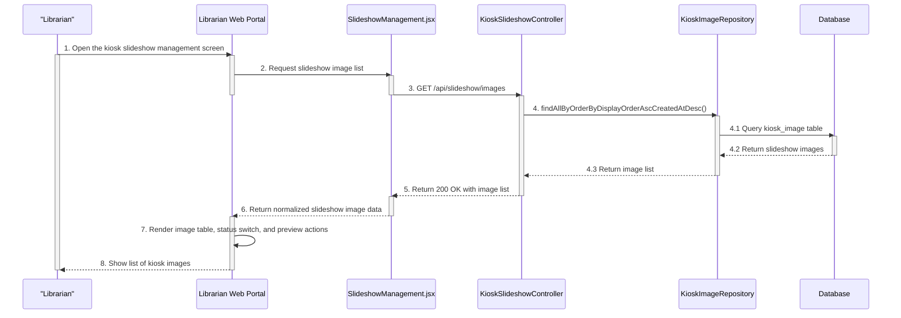

# FE-117 View List of Kiosk Images

```mermaid
sequenceDiagram
    participant Users as "Librarian"
    participant Client as Librarian Web Portal
    participant SlidePage as SlideshowManagement.jsx
    participant SlideController as KioskSlideshowController
    participant ImageRepo as KioskImageRepository
    participant DB as Database

    Users->>Client: 1. Open the kiosk slideshow management screen
    activate Users
    activate Client
    Client->>SlidePage: 2. Request slideshow image list
    activate SlidePage

    SlidePage->>SlideController: 3. GET /api/slideshow/images
    deactivate SlidePage
    deactivate Client
    activate SlideController

    SlideController->>ImageRepo: 4. findAllByOrderByDisplayOrderAscCreatedAtDesc()
    activate ImageRepo
    ImageRepo->>DB: 4.1 Query kiosk_image table
    activate DB
    DB-->>ImageRepo: 4.2 Return slideshow images
    deactivate DB
    ImageRepo-->>SlideController: 4.3 Return image list
    deactivate ImageRepo

    SlideController-->>SlidePage: 5. Return 200 OK with image list
    deactivate SlideController
    activate SlidePage
    SlidePage-->>Client: 6. Return normalized slideshow image data
    deactivate SlidePage
    activate Client

    Client->>Client: 7. Render image table, status switch, and preview actions
    Client-->>Users: 8. Show list of kiosk images

    deactivate Client
    deactivate Users
```
