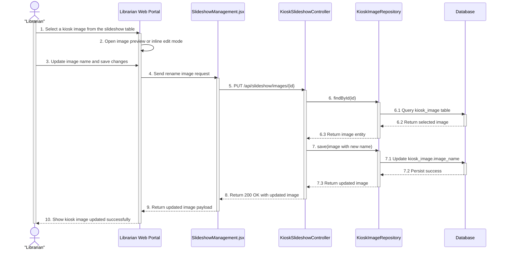

# FE-118a View and Update Kiosk Image

```mermaid
sequenceDiagram
    actor Users as "Librarian"
    participant Client as Librarian Web Portal
    participant SlidePage as SlideshowManagement.jsx
    participant SlideController as KioskSlideshowController
    participant ImageRepo as KioskImageRepository
    participant DB as Database

    activate Users
    Users->>Client: 1. Select a kiosk image from the slideshow table
    activate Client
    
    Client->>Client: 2. Open image preview or inline edit mode
    Users->>Client: 3. Update image name and save changes
    
    # Giai đoạn: Gửi yêu cầu cập nhật
    Client->>SlidePage: 4. Send rename image request
    activate SlidePage
    SlidePage->>SlideController: 5. PUT /api/slideshow/images/{id}
    activate SlideController
    
    # Bước 6: Truy vấn bản ghi hiện tại
    SlideController->>ImageRepo: 6. findById(id)
    activate ImageRepo
    ImageRepo->>DB: 6.1 Query kiosk_image table
    activate DB
    DB-->>ImageRepo: 6.2 Return selected image
    deactivate DB
    ImageRepo-->>SlideController: 6.3 Return image entity
    deactivate ImageRepo

    # Bước 7: Thực thi lưu thay đổi tên ảnh
    SlideController->>ImageRepo: 7. save(image with new name)
    activate ImageRepo
    ImageRepo->>DB: 7.1 Update kiosk_image.image_name
    activate DB
    DB-->>ImageRepo: 7.2 Persist success
    deactivate DB
    ImageRepo-->>SlideController: 7.3 Return updated image
    deactivate ImageRepo
    
    # Trả kết quả về giao diện
    SlideController-->>SlidePage: 8. Return 200 OK with updated image
    deactivate SlideController
    
    SlidePage-->>Client: 9. Return updated image payload
    deactivate SlidePage
    
    Client-->>Users: 10. Show kiosk image updated successfully
    
    deactivate Client
    deactivate Users
```

