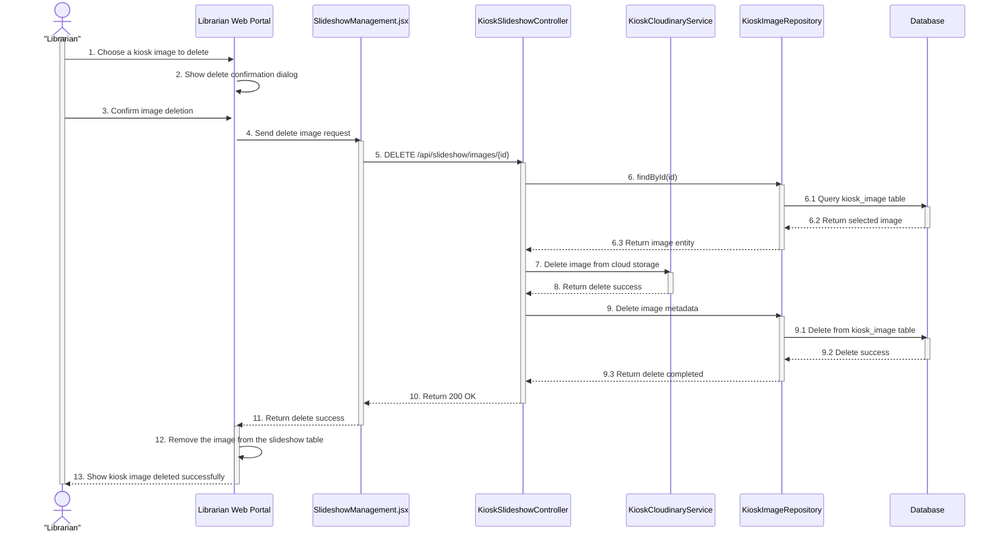

# FE-118c Delete Kiosk Image

```mermaid
sequenceDiagram
    actor Users as "Librarian"
    participant Client as Librarian Web Portal
    participant SlidePage as SlideshowManagement.jsx
    participant SlideController as KioskSlideshowController
    participant CloudinaryService as KioskCloudinaryService
    participant ImageRepo as KioskImageRepository
    participant DB as Database

    activate Users
    Users->>Client: 1. Choose a kiosk image to delete
    activate Client
    
    Client->>Client: 2. Show delete confirmation dialog
    Users->>Client: 3. Confirm image deletion
    
    # Giai đoạn: Gửi yêu cầu xóa
    Client->>SlidePage: 4. Send delete image request
    activate SlidePage
    SlidePage->>SlideController: 5. DELETE /api/slideshow/images/{id}
    activate SlideController
    
    # Bước 6: Truy vấn để lấy thông tin Cloud (PublicId) trước khi xóa
    SlideController->>ImageRepo: 6. findById(id)
    activate ImageRepo
    ImageRepo->>DB: 6.1 Query kiosk_image table
    activate DB
    DB-->>ImageRepo: 6.2 Return selected image
    deactivate DB
    ImageRepo-->>SlideController: 6.3 Return image entity
    deactivate ImageRepo

    # Bước 7 & 8: Xóa file vật lý trên Cloud
    SlideController->>CloudinaryService: 7. Delete image from cloud storage
    activate CloudinaryService
    CloudinaryService-->>SlideController: 8. Return delete success
    deactivate CloudinaryService

    # Bước 9: Xóa Metadata trong Database
    SlideController->>ImageRepo: 9. Delete image metadata
    activate ImageRepo
    ImageRepo->>DB: 9.1 Delete from kiosk_image table
    activate DB
    DB-->>ImageRepo: 9.2 Delete success
    deactivate DB
    ImageRepo-->>SlideController: 9.3 Return delete completed
    deactivate ImageRepo
    
    # Phản hồi kết quả về UI
    SlideController-->>SlidePage: 10. Return 200 OK
    deactivate SlideController
    
    SlidePage-->>Client: 11. Return delete success
    deactivate SlidePage
    
    # Giai đoạn: Cập nhật giao diện Client
    activate Client
    Client->>Client: 12. Remove the image from the slideshow table
    
    Client-->>Users: 13. Show kiosk image deleted successfully
    
    deactivate Client
    deactivate Users
```

