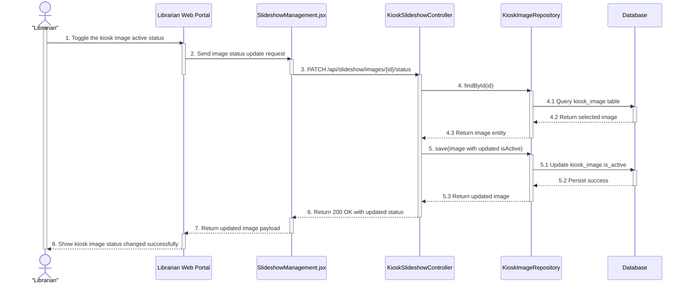

# FE-119 Change Image Status

```mermaid
sequenceDiagram
    actor Users as "Librarian"
    participant Client as Librarian Web Portal
    participant SlidePage as SlideshowManagement.jsx
    participant SlideController as KioskSlideshowController
    participant ImageRepo as KioskImageRepository
    participant DB as Database

    activate Users
    Users->>Client: 1. Toggle the kiosk image active status
    activate Client
    
    # Giai đoạn: Gửi yêu cầu cập nhật trạng thái
    Client->>SlidePage: 2. Send image status update request
    activate SlidePage

    SlidePage->>SlideController: 3. PATCH /api/slideshow/images/{id}/status
    activate SlideController
    deactivate SlidePage
    deactivate Client

    # Bước 4: Truy vấn kiểm tra hình ảnh
    SlideController->>ImageRepo: 4. findById(id)
    activate ImageRepo
    ImageRepo->>DB: 4.1 Query kiosk_image table
    activate DB
    DB-->>ImageRepo: 4.2 Return selected image
    deactivate DB
    ImageRepo-->>SlideController: 4.3 Return image entity
    deactivate ImageRepo

    # Bước 5: Thực thi cập nhật trường is_active
    SlideController->>ImageRepo: 5. save(image with updated isActive)
    activate ImageRepo
    ImageRepo->>DB: 5.1 Update kiosk_image.is_active
    activate DB
    DB-->>ImageRepo: 5.2 Persist success
    deactivate DB
    ImageRepo-->>SlideController: 5.3 Return updated image
    deactivate ImageRepo

    # Phản hồi kết quả về UI
    SlideController-->>SlidePage: 6. Return 200 OK with updated status
    deactivate SlideController
    
    activate SlidePage
    SlidePage-->>Client: 7. Return updated image payload
    deactivate SlidePage
    
    activate Client
    Client-->>Users: 8. Show kiosk image status changed successfully

    deactivate Client
    deactivate Users
```

