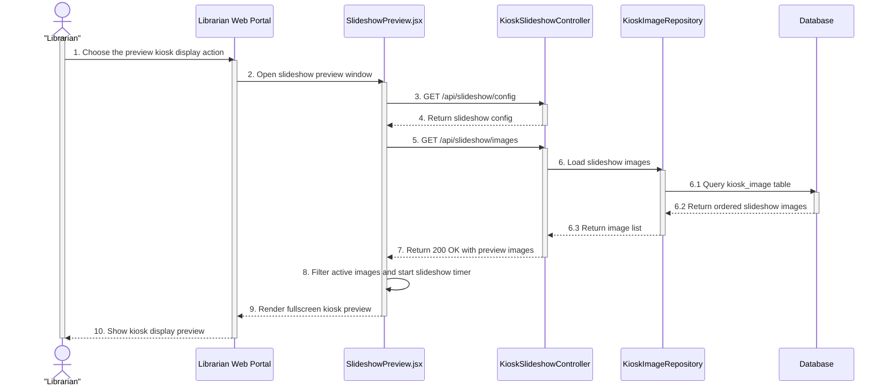

# FE-120 Preview Kiosk Display

```mermaid
sequenceDiagram
    actor Users as "Librarian"
    participant Client as Librarian Web Portal
    participant PreviewPage as SlideshowPreview.jsx
    participant SlideController as KioskSlideshowController
    participant ImageRepo as KioskImageRepository
    participant DB as Database

    activate Users
    Users->>Client: 1. Choose the preview kiosk display action
    activate Client
    
    Client->>PreviewPage: 2. Open slideshow preview window
    activate PreviewPage

    # Giai đoạn 1: Lấy cấu hình Trình chiếu (Thời gian chuyển slide, hiệu ứng...)
    PreviewPage->>SlideController: 3. GET /api/slideshow/config
    activate SlideController
    SlideController-->>PreviewPage: 4. Return slideshow config
    deactivate SlideController

    # Giai đoạn 2: Lấy danh sách hình ảnh
    PreviewPage->>SlideController: 5. GET /api/slideshow/images
    activate SlideController
    
    SlideController->>ImageRepo: 6. Load slideshow images
    activate ImageRepo
    ImageRepo->>DB: 6.1 Query kiosk_image table
    activate DB
    DB-->>ImageRepo: 6.2 Return ordered slideshow images
    deactivate DB
    ImageRepo-->>SlideController: 6.3 Return image list
    deactivate ImageRepo
    
    SlideController-->>PreviewPage: 7. Return 200 OK with preview images
    deactivate SlideController

    # Giai đoạn 3: Xử lý hiển thị tại Frontend
    PreviewPage->>PreviewPage: 8. Filter active images and start slideshow timer
    
    PreviewPage-->>Client: 9. Render fullscreen kiosk preview
    deactivate PreviewPage
    
    Client-->>Users: 10. Show kiosk display preview

    deactivate Client
    deactivate Users
```

