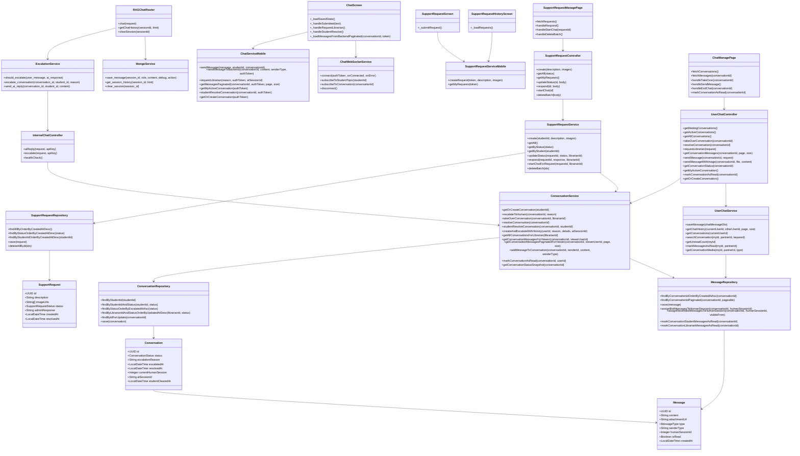

# Chat & Support Module Class Diagram

```mermaid
classDiagram
    class UserChatController {
        +getWaitingConversations()
        +getActiveConversations()
        +getAllConversations()
        +takeOverConversation(conversationId)
        +resolveConversation(conversationId)
        +requestLibrarian(request)
        +getConversationMessages(conversationId, page, size)
        +sendMessage(conversationId, request)
        +sendMessageWithImage(conversationId, file, content)
        +getConversationStatus(conversationId)
        +getMyActiveConversation()
        +markConversationAsRead(conversationId)
        +getOrCreateConversation()
    }

    class InternalChatController {
        +aiReply(request, apiKey)
        +escalate(request, apiKey)
        +healthCheck()
    }

    class SupportRequestController {
        +create(description, images)
        +getAll(status)
        +getMyRequests()
        +updateStatus(id, body)
        +respond(id, body)
        +startChat(id)
        +deleteBatch(body)
    }

    class ConversationService {
        +getOrCreateConversation(studentId)
        +escalateToHuman(conversationId, reason)
        +takeOverConversation(conversationId, librarianId)
        +resolveConversation(conversationId)
        +studentResolveConversation(conversationId, studentId)
        +createAndEscalateWithHistory(userId, reason, details, aiSessionId)
        +getAllConversationsForLibrarian(librarianId)
        +getConversationMessagesForViewer(conversationId, viewerUserId)
        +getConversationMessagesPaginatedForViewer(conversationId, viewerUserId, page, size)
        +addMessageToConversation(conversationId, senderId, content, senderType)
        +markConversationAsRead(conversationId, userId)
        +getConversationStatusSnapshot(conversationId)
    }

    class UserChatService {
        +saveMessage(chatMessageDto)
        +getChatHistory(currentUserId, otherUserId, page, size)
        +getConversations(currentUserId)
        +searchConversation(myId, partnerId, keyword)
        +getUnreadCount(myId)
        +markMessagesAsRead(myId, partnerId)
        +getConversationMedia(myId, partnerId, type)
    }

    class SupportRequestService {
        +create(studentId, description, images)
        +getAll()
        +getByStatus(status)
        +getByStudent(studentId)
        +updateStatus(requestId, status, librarianId)
        +respond(requestId, response, librarianId)
        +startChatForRequest(requestId, librarianId)
        +deleteBatch(ids)
    }

    class RAGChatRouter {
        +chat(request)
        +getChatHistory(sessionId, limit)
        +clearSession(sessionId)
    }

    class EscalationService {
        +should_escalate(user_message, ai_response)
        +escalate_conversation(conversation_id, student_id, reason)
        +send_ai_reply(conversation_id, student_id, content)
    }

    class MongoService {
        +save_message(session_id, role, content, debug, action)
        +get_session_history(session_id, limit)
        +clear_session(session_id)
    }

    class ConversationRepository {
        +findByStudentId(studentId)
        +findByStudentIdAndStatus(studentId, status)
        +findByStatusOrderByEscalatedAtAsc(status)
        +findByLibrarianIdAndStatusOrderByUpdatedAtDesc(librarianId, status)
        +findByIdForUpdate(conversationId)
        +save(conversation)
    }

    class MessageRepository {
        +findByConversationIdOrderByCreatedAtAsc(conversationId)
        +findByConversationIdPaginated(conversationId, pageable)
        +save(message)
        +assignBotMessagesToHumanSession(conversationId, humanSessionId)
        +assignRecentBotMessagesToHumanSession(conversationId, humanSessionId, visibleFrom)
        +markConversationStudentMessagesAsRead(conversationId)
        +markConversationLibrarianMessagesAsRead(conversationId)
    }

    class SupportRequestRepository {
        +findAllByOrderByCreatedAtDesc()
        +findByStatusOrderByCreatedAtDesc(status)
        +findByStudentIdOrderByCreatedAtDesc(studentId)
        +save(request)
        +deleteAllById(ids)
    }

    class Conversation {
        +UUID id
        +ConversationStatus status
        +String escalationReason
        +LocalDateTime escalatedAt
        +LocalDateTime resolvedAt
        +Integer currentHumanSession
        +String aiSessionId
        +LocalDateTime studentClearedAt
    }

    class Message {
        +UUID id
        +String content
        +String attachmentUrl
        +MessageType type
        +String senderType
        +Integer humanSessionId
        +Boolean isRead
        +LocalDateTime createdAt
    }

    class SupportRequest {
        +UUID id
        +String description
        +String[] imageUrls
        +SupportRequestStatus status
        +String adminResponse
        +LocalDateTime createdAt
        +LocalDateTime resolvedAt
    }

    class ChatScreen {
        +_loadSavedState()
        +_handleSubmitted(text)
        +_handleRequestLibrarian()
        +_handleStudentResolve()
        +_loadMessagesFromBackendPaginated(conversationId, token)
    }

    class ChatServiceMobile {
        +sendMessage(message, studentId, conversationId)
        +sendMessageToBackend(conversationId, content, senderType, authToken)
        +requestLibrarian(reason, authToken, aiSessionId)
        +getMessagesPaginated(conversationId, authToken, page, size)
        +getMyActiveConversation(authToken)
        +studentResolveConversation(conversationId, authToken)
        +getOrCreateConversation(authToken)
    }

    class ChatWebSocketService {
        +connect(authToken, onConnected, onError)
        +subscribeToStudentTopic(studentId)
        +subscribeToConversation(conversationId)
        +disconnect()
    }

    class SupportRequestScreen {
        +_submitRequest()
    }

    class SupportRequestHistoryScreen {
        +_loadRequests()
    }

    class SupportRequestServiceMobile {
        +createRequest(token, description, images)
        +getMyRequests(token)
    }

    class ChatManagePage {
        +fetchConversations()
        +fetchMessages(conversationId)
        +handleTakeOver(conversationId)
        +handleSendMessage()
        +handleEndChat(conversationId)
        +markConversationAsRead(conversationId)
    }

    class SupportRequestManagePage {
        +fetchRequests()
        +handleRespond()
        +handleStartChat(requestId)
        +handleDeleteBatch()
    }

    UserChatController --> ConversationService
    UserChatController --> UserChatService
    InternalChatController --> ConversationService
    SupportRequestController --> SupportRequestService

    ConversationService --> ConversationRepository
    ConversationService --> MessageRepository
    UserChatService --> MessageRepository
    SupportRequestService --> SupportRequestRepository
    SupportRequestService --> ConversationService

    ConversationRepository --> Conversation
    MessageRepository --> Message
    SupportRequestRepository --> SupportRequest
    Conversation --> Message

    RAGChatRouter --> EscalationService
    RAGChatRouter --> MongoService
    EscalationService --> InternalChatController

    ChatScreen --> ChatServiceMobile
    ChatScreen --> ChatWebSocketService
    SupportRequestScreen --> SupportRequestServiceMobile
    SupportRequestHistoryScreen --> SupportRequestServiceMobile
    ChatManagePage --> UserChatController
    SupportRequestManagePage --> SupportRequestController
```
