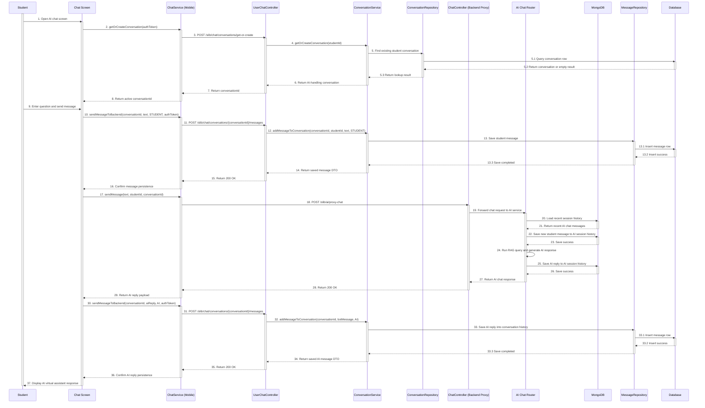

# FE-113 Chat with AI Virtual Assistant

```mermaid
sequenceDiagram
    participant Student as Student
    participant ChatScreen as Chat Screen
    participant MobileChatService as ChatService (Mobile)
    participant UserChatController as UserChatController
    participant ConversationService as ConversationService
    participant ConversationRepo as ConversationRepository
    participant AIProxyController as ChatController (Backend Proxy)
    participant AIService as AI Chat Router
    participant MongoDB as MongoDB
    participant MessageRepo as MessageRepository
    participant DB as Database

    activate Student
    Student->>ChatScreen: 1. Open AI chat screen
    activate ChatScreen
    ChatScreen->>MobileChatService: 2. getOrCreateConversation(authToken)
    activate MobileChatService
    MobileChatService->>UserChatController: 3. POST /slib/chat/conversations/get-or-create
    activate UserChatController
    UserChatController->>ConversationService: 4. getOrCreateConversation(studentId)
    activate ConversationService
    ConversationService->>ConversationRepo: 5. Find existing student conversation
    activate ConversationRepo
    ConversationRepo->>DB: 5.1 Query conversation row
    activate DB
    DB-->>ConversationRepo: 5.2 Return conversation or empty result
    deactivate DB
    ConversationRepo-->>ConversationService: 5.3 Return lookup result
    deactivate ConversationRepo
    ConversationService-->>UserChatController: 6. Return AI-handling conversation
    deactivate ConversationService
    UserChatController-->>MobileChatService: 7. Return conversationId
    deactivate UserChatController
    MobileChatService-->>ChatScreen: 8. Return active conversationId
    deactivate MobileChatService

    Student->>ChatScreen: 9. Enter question and send message
    ChatScreen->>MobileChatService: 10. sendMessageToBackend(conversationId, text, STUDENT, authToken)
    activate MobileChatService
    MobileChatService->>UserChatController: 11. POST /slib/chat/conversations/{conversationId}/messages
    activate UserChatController
    UserChatController->>ConversationService: 12. addMessageToConversation(conversationId, studentId, text, STUDENT)
    activate ConversationService
    ConversationService->>MessageRepo: 13. Save student message
    activate MessageRepo
    MessageRepo->>DB: 13.1 Insert message row
    activate DB
    DB-->>MessageRepo: 13.2 Insert success
    deactivate DB
    MessageRepo-->>ConversationService: 13.3 Save completed
    deactivate MessageRepo
    ConversationService-->>UserChatController: 14. Return saved message DTO
    deactivate ConversationService
    UserChatController-->>MobileChatService: 15. Return 200 OK
    deactivate UserChatController
    MobileChatService-->>ChatScreen: 16. Confirm message persistence
    deactivate MobileChatService

    ChatScreen->>MobileChatService: 17. sendMessage(text, studentId, conversationId)
    activate MobileChatService
    MobileChatService->>AIProxyController: 18. POST /slib/ai/proxy-chat
    activate AIProxyController
    AIProxyController->>AIService: 19. Forward chat request to AI service
    activate AIService
    AIService->>MongoDB: 20. Load recent session history
    activate MongoDB
    MongoDB-->>AIService: 21. Return recent AI chat messages
    deactivate MongoDB
    AIService->>MongoDB: 22. Save new student message to AI session history
    activate MongoDB
    MongoDB-->>AIService: 23. Save success
    deactivate MongoDB
    AIService->>AIService: 24. Run RAG query and generate AI response
    AIService->>MongoDB: 25. Save AI reply to AI session history
    activate MongoDB
    MongoDB-->>AIService: 26. Save success
    deactivate MongoDB
    AIService-->>AIProxyController: 27. Return AI chat response
    deactivate AIService
    AIProxyController-->>MobileChatService: 28. Return 200 OK
    deactivate AIProxyController
    MobileChatService-->>ChatScreen: 29. Return AI reply payload
    deactivate MobileChatService

    ChatScreen->>MobileChatService: 30. sendMessageToBackend(conversationId, aiReply, AI, authToken)
    activate MobileChatService
    MobileChatService->>UserChatController: 31. POST /slib/chat/conversations/{conversationId}/messages
    activate UserChatController
    UserChatController->>ConversationService: 32. addMessageToConversation(conversationId, botMessage, AI)
    activate ConversationService
    ConversationService->>MessageRepo: 33. Save AI reply into conversation history
    activate MessageRepo
    MessageRepo->>DB: 33.1 Insert message row
    activate DB
    DB-->>MessageRepo: 33.2 Insert success
    deactivate DB
    MessageRepo-->>ConversationService: 33.3 Save completed
    deactivate MessageRepo
    ConversationService-->>UserChatController: 34. Return saved AI message DTO
    deactivate ConversationService
    UserChatController-->>MobileChatService: 35. Return 200 OK
    deactivate UserChatController
    MobileChatService-->>ChatScreen: 36. Confirm AI reply persistence
    deactivate MobileChatService
    ChatScreen-->>Student: 37. Display AI virtual assistant response
    deactivate ChatScreen
    deactivate Student
```
