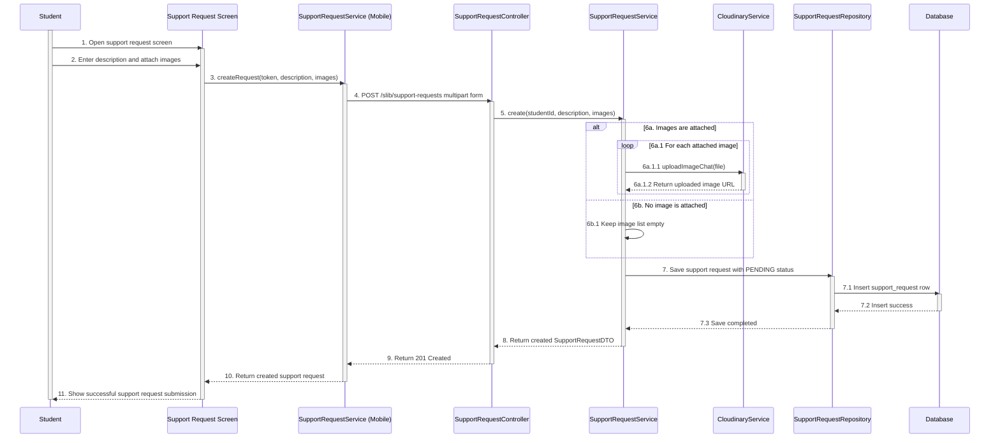

# FE-115 Send Request for Support

```mermaid
sequenceDiagram
    participant Student as Student
    participant SupportScreen as Support Request Screen
    participant MobileSupportService as SupportRequestService (Mobile)
    participant SupportController as SupportRequestController
    participant SupportService as SupportRequestService
    participant Cloudinary as CloudinaryService
    participant SupportRepo as SupportRequestRepository
    participant DB as Database

    activate Student
    Student->>SupportScreen: 1. Open support request screen
    activate SupportScreen
    Student->>SupportScreen: 2. Enter description and attach images
    SupportScreen->>MobileSupportService: 3. createRequest(token, description, images)
    activate MobileSupportService
    MobileSupportService->>SupportController: 4. POST /slib/support-requests multipart form
    activate SupportController
    SupportController->>SupportService: 5. create(studentId, description, images)
    activate SupportService
    alt 6a. Images are attached
        loop 6a.1 For each attached image
            SupportService->>Cloudinary: 6a.1.1 uploadImageChat(file)
            activate Cloudinary
            Cloudinary-->>SupportService: 6a.1.2 Return uploaded image URL
            deactivate Cloudinary
        end
    else 6b. No image is attached
        SupportService->>SupportService: 6b.1 Keep image list empty
    end
    SupportService->>SupportRepo: 7. Save support request with PENDING status
    activate SupportRepo
    SupportRepo->>DB: 7.1 Insert support_request row
    activate DB
    DB-->>SupportRepo: 7.2 Insert success
    deactivate DB
    SupportRepo-->>SupportService: 7.3 Save completed
    deactivate SupportRepo
    SupportService-->>SupportController: 8. Return created SupportRequestDTO
    deactivate SupportService
    SupportController-->>MobileSupportService: 9. Return 201 Created
    deactivate SupportController
    MobileSupportService-->>SupportScreen: 10. Return created support request
    deactivate MobileSupportService
    SupportScreen-->>Student: 11. Show successful support request submission
    deactivate SupportScreen
    deactivate Student
```
