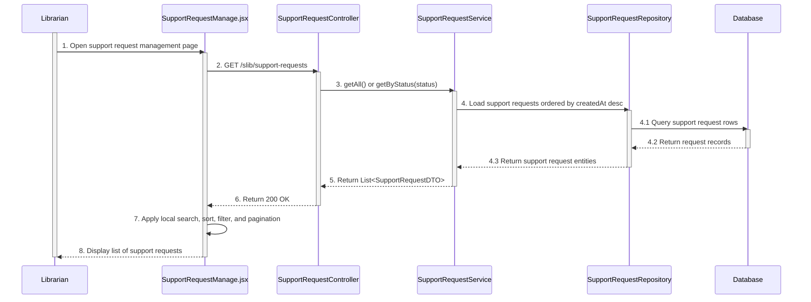

# FE-116 View List of Support Requests

```mermaid
sequenceDiagram
    participant Librarian as Librarian
    participant SupportManagePage as SupportRequestManage.jsx
    participant SupportController as SupportRequestController
    participant SupportService as SupportRequestService
    participant SupportRepo as SupportRequestRepository
    participant DB as Database

    activate Librarian
    Librarian->>SupportManagePage: 1. Open support request management page
    activate SupportManagePage
    SupportManagePage->>SupportController: 2. GET /slib/support-requests
    activate SupportController
    SupportController->>SupportService: 3. getAll() or getByStatus(status)
    activate SupportService
    SupportService->>SupportRepo: 4. Load support requests ordered by createdAt desc
    activate SupportRepo
    SupportRepo->>DB: 4.1 Query support request rows
    activate DB
    DB-->>SupportRepo: 4.2 Return request records
    deactivate DB
    SupportRepo-->>SupportService: 4.3 Return support request entities
    deactivate SupportRepo
    SupportService-->>SupportController: 5. Return List<SupportRequestDTO>
    deactivate SupportService
    SupportController-->>SupportManagePage: 6. Return 200 OK
    deactivate SupportController
    SupportManagePage->>SupportManagePage: 7. Apply local search, sort, filter, and pagination
    SupportManagePage-->>Librarian: 8. Display list of support requests
    deactivate SupportManagePage
    deactivate Librarian
```
