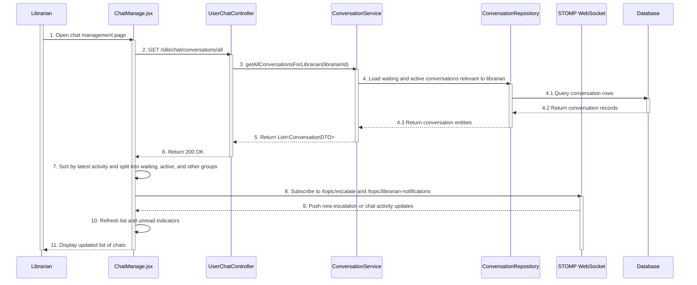

# FE-118 View List of Chats

```mermaid
sequenceDiagram
    participant Librarian as Librarian
    participant ChatManagePage as ChatManage.jsx
    participant UserChatController as UserChatController
    participant ConversationService as ConversationService
    participant ConversationRepo as ConversationRepository
    participant WebSocket as STOMP WebSocket
    participant DB as Database

    activate Librarian
    Librarian->>ChatManagePage: 1. Open chat management page
    activate ChatManagePage
    ChatManagePage->>UserChatController: 2. GET /slib/chat/conversations/all
    activate UserChatController
    UserChatController->>ConversationService: 3. getAllConversationsForLibrarian(librarianId)
    activate ConversationService
    ConversationService->>ConversationRepo: 4. Load waiting and active conversations relevant to librarian
    activate ConversationRepo
    ConversationRepo->>DB: 4.1 Query conversation rows
    activate DB
    DB-->>ConversationRepo: 4.2 Return conversation records
    deactivate DB
    ConversationRepo-->>ConversationService: 4.3 Return conversation entities
    deactivate ConversationRepo
    ConversationService-->>UserChatController: 5. Return List<ConversationDTO>
    deactivate ConversationService
    UserChatController-->>ChatManagePage: 6. Return 200 OK
    deactivate UserChatController
    ChatManagePage->>ChatManagePage: 7. Sort by latest activity and split into waiting, active, and other groups
    ChatManagePage->>WebSocket: 8. Subscribe to /topic/escalate and /topic/librarian-notifications
    activate WebSocket
    WebSocket-->>ChatManagePage: 9. Push new escalation or chat activity updates
    ChatManagePage->>ChatManagePage: 10. Refresh list and unread indicators
    ChatManagePage-->>Librarian: 11. Display updated list of chats
    deactivate WebSocket
    deactivate ChatManagePage
    deactivate Librarian
```
