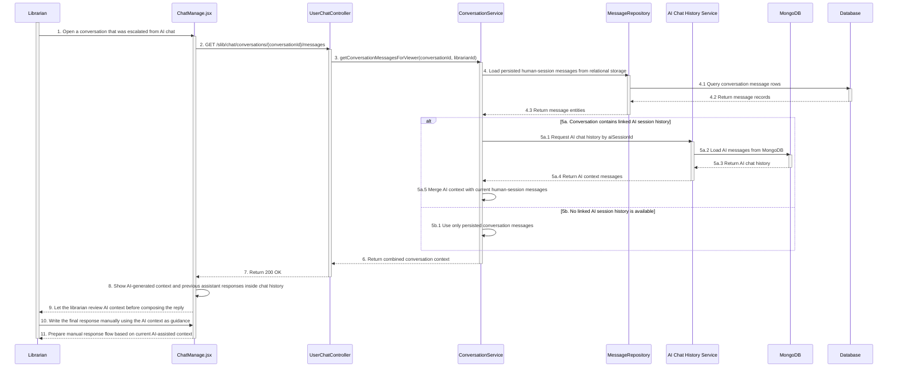

# FE-121 Response to User with AI Suggestion

```mermaid
sequenceDiagram
    participant Librarian as Librarian
    participant ChatManagePage as ChatManage.jsx
    participant UserChatController as UserChatController
    participant ConversationService as ConversationService
    participant MessageRepo as MessageRepository
    participant AIService as AI Chat History Service
    participant MongoDB as MongoDB
    participant DB as Database

    activate Librarian
    Librarian->>ChatManagePage: 1. Open a conversation that was escalated from AI chat
    activate ChatManagePage
    ChatManagePage->>UserChatController: 2. GET /slib/chat/conversations/{conversationId}/messages
    activate UserChatController
    UserChatController->>ConversationService: 3. getConversationMessagesForViewer(conversationId, librarianId)
    activate ConversationService
    ConversationService->>MessageRepo: 4. Load persisted human-session messages from relational storage
    activate MessageRepo
    MessageRepo->>DB: 4.1 Query conversation message rows
    activate DB
    DB-->>MessageRepo: 4.2 Return message records
    deactivate DB
    MessageRepo-->>ConversationService: 4.3 Return message entities
    deactivate MessageRepo
    alt 5a. Conversation contains linked AI session history
        ConversationService->>AIService: 5a.1 Request AI chat history by aiSessionId
        activate AIService
        AIService->>MongoDB: 5a.2 Load AI messages from MongoDB
        activate MongoDB
        MongoDB-->>AIService: 5a.3 Return AI chat history
        deactivate MongoDB
        AIService-->>ConversationService: 5a.4 Return AI context messages
        deactivate AIService
        ConversationService->>ConversationService: 5a.5 Merge AI context with current human-session messages
    else 5b. No linked AI session history is available
        ConversationService->>ConversationService: 5b.1 Use only persisted conversation messages
    end
    ConversationService-->>UserChatController: 6. Return combined conversation context
    deactivate ConversationService
    UserChatController-->>ChatManagePage: 7. Return 200 OK
    deactivate UserChatController
    ChatManagePage->>ChatManagePage: 8. Show AI-generated context and previous assistant responses inside chat history
    ChatManagePage-->>Librarian: 9. Let the librarian review AI context before composing the reply
    Librarian->>ChatManagePage: 10. Write the final response manually using the AI context as guidance
    ChatManagePage-->>Librarian: 11. Prepare manual response flow based on current AI-assisted context
    deactivate ChatManagePage
    deactivate Librarian
```
