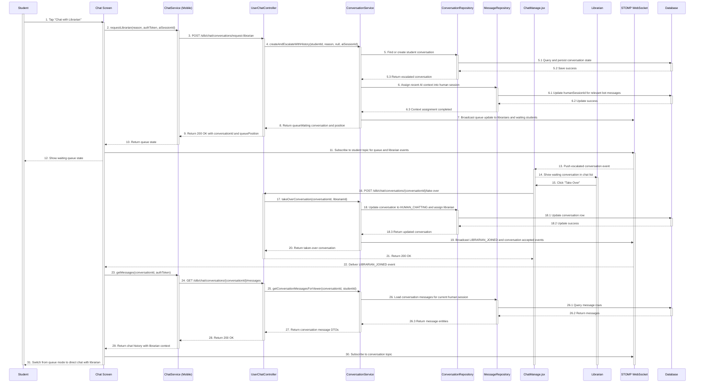

# FE-122 Chat with Librarian

```mermaid
sequenceDiagram
    participant Student as Student
    participant ChatScreen as Chat Screen
    participant MobileChatService as ChatService (Mobile)
    participant UserChatController as UserChatController
    participant ConversationService as ConversationService
    participant ConversationRepo as ConversationRepository
    participant MessageRepo as MessageRepository
    participant ChatManagePage as ChatManage.jsx
    participant Librarian as Librarian
    participant WebSocket as STOMP WebSocket
    participant DB as Database

    activate Student
    Student->>ChatScreen: 1. Tap "Chat with Librarian"
    activate ChatScreen
    ChatScreen->>MobileChatService: 2. requestLibrarian(reason, authToken, aiSessionId)
    activate MobileChatService
    MobileChatService->>UserChatController: 3. POST /slib/chat/conversations/request-librarian
    activate UserChatController
    UserChatController->>ConversationService: 4. createAndEscalateWithHistory(studentId, reason, null, aiSessionId)
    activate ConversationService
    ConversationService->>ConversationRepo: 5. Find or create student conversation
    activate ConversationRepo
    ConversationRepo->>DB: 5.1 Query and persist conversation state
    activate DB
    DB-->>ConversationRepo: 5.2 Save success
    deactivate DB
    ConversationRepo-->>ConversationService: 5.3 Return escalated conversation
    deactivate ConversationRepo
    ConversationService->>MessageRepo: 6. Assign recent AI context into human session
    activate MessageRepo
    MessageRepo->>DB: 6.1 Update humanSessionId for relevant bot messages
    activate DB
    DB-->>MessageRepo: 6.2 Update success
    deactivate DB
    MessageRepo-->>ConversationService: 6.3 Context assignment completed
    deactivate MessageRepo
    ConversationService->>WebSocket: 7. Broadcast queue update to librarians and waiting students
    ConversationService-->>UserChatController: 8. Return queueWaiting conversation and position
    deactivate ConversationService
    UserChatController-->>MobileChatService: 9. Return 200 OK with conversationId and queuePosition
    deactivate UserChatController
    MobileChatService-->>ChatScreen: 10. Return queue state
    deactivate MobileChatService
    ChatScreen->>WebSocket: 11. Subscribe to student topic for queue and librarian events
    activate WebSocket
    ChatScreen-->>Student: 12. Show waiting queue state

    WebSocket-->>ChatManagePage: 13. Push escalated conversation event
    activate ChatManagePage
    ChatManagePage-->>Librarian: 14. Show waiting conversation in chat list
    activate Librarian
    Librarian->>ChatManagePage: 15. Click "Take Over"
    ChatManagePage->>UserChatController: 16. POST /slib/chat/conversations/{conversationId}/take-over
    activate UserChatController
    UserChatController->>ConversationService: 17. takeOverConversation(conversationId, librarianId)
    activate ConversationService
    ConversationService->>ConversationRepo: 18. Update conversation to HUMAN_CHATTING and assign librarian
    activate ConversationRepo
    ConversationRepo->>DB: 18.1 Update conversation row
    activate DB
    DB-->>ConversationRepo: 18.2 Update success
    deactivate DB
    ConversationRepo-->>ConversationService: 18.3 Return updated conversation
    deactivate ConversationRepo
    ConversationService->>WebSocket: 19. Broadcast LIBRARIAN_JOINED and conversation accepted events
    ConversationService-->>UserChatController: 20. Return taken-over conversation
    deactivate ConversationService
    UserChatController-->>ChatManagePage: 21. Return 200 OK
    deactivate UserChatController

    WebSocket-->>ChatScreen: 22. Deliver LIBRARIAN_JOINED event
    ChatScreen->>MobileChatService: 23. getMessages(conversationId, authToken)
    activate MobileChatService
    MobileChatService->>UserChatController: 24. GET /slib/chat/conversations/{conversationId}/messages
    activate UserChatController
    UserChatController->>ConversationService: 25. getConversationMessagesForViewer(conversationId, studentId)
    activate ConversationService
    ConversationService->>MessageRepo: 26. Load conversation messages for current human session
    activate MessageRepo
    MessageRepo->>DB: 26.1 Query message rows
    activate DB
    DB-->>MessageRepo: 26.2 Return messages
    deactivate DB
    MessageRepo-->>ConversationService: 26.3 Return message entities
    deactivate MessageRepo
    ConversationService-->>UserChatController: 27. Return conversation message DTOs
    deactivate ConversationService
    UserChatController-->>MobileChatService: 28. Return 200 OK
    deactivate UserChatController
    MobileChatService-->>ChatScreen: 29. Return chat history with librarian context
    deactivate MobileChatService
    ChatScreen->>WebSocket: 30. Subscribe to conversation topic
    ChatScreen-->>Student: 31. Switch from queue mode to direct chat with librarian
    deactivate WebSocket
    deactivate ChatManagePage
    deactivate Librarian
    deactivate ChatScreen
    deactivate Student
```

