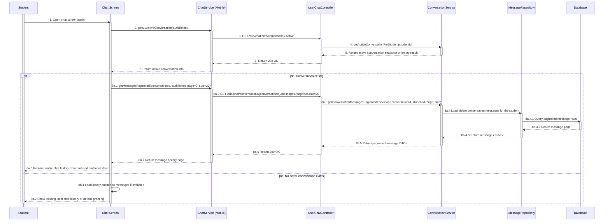

# FE-125 View History of Chat

```mermaid
sequenceDiagram
    participant Student as Student
    participant ChatScreen as Chat Screen
    participant MobileChatService as ChatService (Mobile)
    participant UserChatController as UserChatController
    participant ConversationService as ConversationService
    participant MessageRepo as MessageRepository
    participant DB as Database

    activate Student
    Student->>ChatScreen: 1. Open chat screen again
    activate ChatScreen
    ChatScreen->>MobileChatService: 2. getMyActiveConversation(authToken)
    activate MobileChatService
    MobileChatService->>UserChatController: 3. GET /slib/chat/conversations/my-active
    activate UserChatController
    UserChatController->>ConversationService: 4. getActiveConversationForStudent(studentId)
    activate ConversationService
    ConversationService-->>UserChatController: 5. Return active conversation snapshot or empty result
    deactivate ConversationService
    UserChatController-->>MobileChatService: 6. Return 200 OK
    deactivate UserChatController
    MobileChatService-->>ChatScreen: 7. Return active conversation info
    deactivate MobileChatService

    alt 8a. Conversation exists
        ChatScreen->>MobileChatService: 8a.1 getMessagesPaginated(conversationId, authToken, page=0, size=20)
        activate MobileChatService
        MobileChatService->>UserChatController: 8a.2 GET /slib/chat/conversations/{conversationId}/messages?page=0&size=20
        activate UserChatController
        UserChatController->>ConversationService: 8a.3 getConversationMessagesPaginatedForViewer(conversationId, studentId, page, size)
        activate ConversationService
        ConversationService->>MessageRepo: 8a.4 Load visible conversation messages for the student
        activate MessageRepo
        MessageRepo->>DB: 8a.4.1 Query paginated message rows
        activate DB
        DB-->>MessageRepo: 8a.4.2 Return message page
        deactivate DB
        MessageRepo-->>ConversationService: 8a.4.3 Return message entities
        deactivate MessageRepo
        ConversationService-->>UserChatController: 8a.5 Return paginated message DTOs
        deactivate ConversationService
        UserChatController-->>MobileChatService: 8a.6 Return 200 OK
        deactivate UserChatController
        MobileChatService-->>ChatScreen: 8a.7 Return message history page
        deactivate MobileChatService
        ChatScreen-->>Student: 8a.8 Restore visible chat history from backend and local state
    else 8b. No active conversation exists
        ChatScreen->>ChatScreen: 8b.1 Load locally cached AI messages if available
        ChatScreen-->>Student: 8b.2 Show existing local chat history or default greeting
    end

    deactivate ChatScreen
    deactivate Student
```

