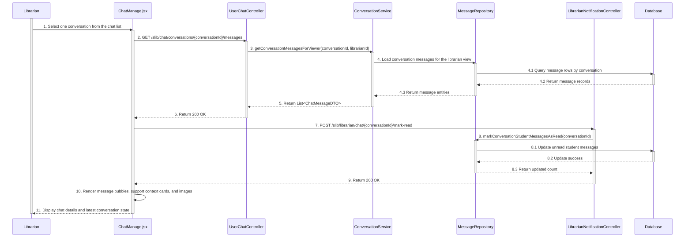

# FE-127 View Chat Details

```mermaid
sequenceDiagram
    participant Librarian as Librarian
    participant ChatManagePage as ChatManage.jsx
    participant UserChatController as UserChatController
    participant ConversationService as ConversationService
    participant MessageRepo as MessageRepository
    participant LibrarianNotificationController as LibrarianNotificationController
    participant DB as Database

    activate Librarian
    Librarian->>ChatManagePage: 1. Select one conversation from the chat list
    activate ChatManagePage
    ChatManagePage->>UserChatController: 2. GET /slib/chat/conversations/{conversationId}/messages
    activate UserChatController
    UserChatController->>ConversationService: 3. getConversationMessagesForViewer(conversationId, librarianId)
    activate ConversationService
    ConversationService->>MessageRepo: 4. Load conversation messages for the librarian view
    activate MessageRepo
    MessageRepo->>DB: 4.1 Query message rows by conversation
    activate DB
    DB-->>MessageRepo: 4.2 Return message records
    deactivate DB
    MessageRepo-->>ConversationService: 4.3 Return message entities
    deactivate MessageRepo
    ConversationService-->>UserChatController: 5. Return List<ChatMessageDTO>
    deactivate ConversationService
    UserChatController-->>ChatManagePage: 6. Return 200 OK
    deactivate UserChatController

    ChatManagePage->>LibrarianNotificationController: 7. POST /slib/librarian/chat/{conversationId}/mark-read
    activate LibrarianNotificationController
    LibrarianNotificationController->>MessageRepo: 8. markConversationStudentMessagesAsRead(conversationId)
    activate MessageRepo
    MessageRepo->>DB: 8.1 Update unread student messages
    activate DB
    DB-->>MessageRepo: 8.2 Update success
    deactivate DB
    MessageRepo-->>LibrarianNotificationController: 8.3 Return updated count
    deactivate MessageRepo
    LibrarianNotificationController-->>ChatManagePage: 9. Return 200 OK
    deactivate LibrarianNotificationController

    ChatManagePage->>ChatManagePage: 10. Render message bubbles, support context cards, and images
    ChatManagePage-->>Librarian: 11. Display chat details and latest conversation state
    deactivate ChatManagePage
    deactivate Librarian
```

