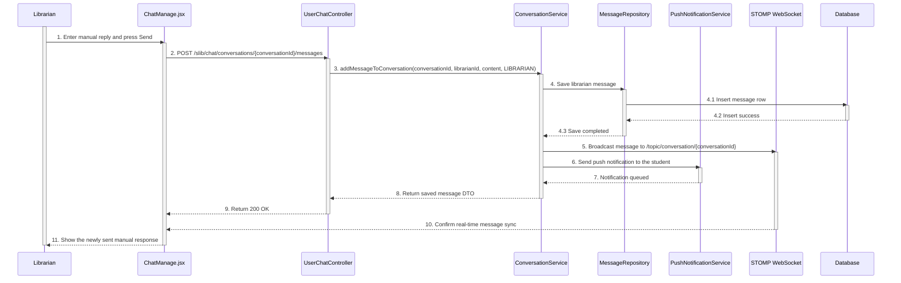

# FE-128 Response to User Manually

```mermaid
sequenceDiagram
    participant Librarian as Librarian
    participant ChatManagePage as ChatManage.jsx
    participant UserChatController as UserChatController
    participant ConversationService as ConversationService
    participant MessageRepo as MessageRepository
    participant PushService as PushNotificationService
    participant WebSocket as STOMP WebSocket
    participant DB as Database

    activate Librarian
    Librarian->>ChatManagePage: 1. Enter manual reply and press Send
    activate ChatManagePage
    ChatManagePage->>UserChatController: 2. POST /slib/chat/conversations/{conversationId}/messages
    activate UserChatController
    UserChatController->>ConversationService: 3. addMessageToConversation(conversationId, librarianId, content, LIBRARIAN)
    activate ConversationService
    ConversationService->>MessageRepo: 4. Save librarian message
    activate MessageRepo
    MessageRepo->>DB: 4.1 Insert message row
    activate DB
    DB-->>MessageRepo: 4.2 Insert success
    deactivate DB
    MessageRepo-->>ConversationService: 4.3 Save completed
    deactivate MessageRepo
    ConversationService->>WebSocket: 5. Broadcast message to /topic/conversation/{conversationId}
    activate WebSocket
    ConversationService->>PushService: 6. Send push notification to the student
    activate PushService
    PushService-->>ConversationService: 7. Notification queued
    deactivate PushService
    ConversationService-->>UserChatController: 8. Return saved message DTO
    deactivate ConversationService
    UserChatController-->>ChatManagePage: 9. Return 200 OK
    deactivate UserChatController
    WebSocket-->>ChatManagePage: 10. Confirm real-time message sync
    deactivate WebSocket
    ChatManagePage-->>Librarian: 11. Show the newly sent manual response
    deactivate ChatManagePage
    deactivate Librarian
```

