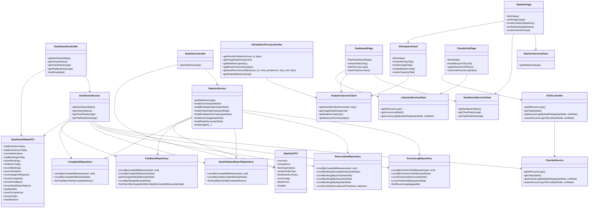

# Statistics & Report Module Class Diagram

```mermaid
classDiagram
    class DashboardController {
        +getDashboardStats()
        +getLibraryStatus()
        +getChartStats(range)
        +getTopStudents(range)
        +testBroadcast()
    }

    class StatisticController {
        +getStatistics(range)
    }

    class AIAnalyticsProxyController {
        +getDensityPrediction(zone_id, days)
        +getUsageStatistics(period)
        +getRealtimeCapacity()
        +getBehaviorSummary(days)
        +getSeatRecommendation(user_id, zone_preference, time_slot, date)
        +getStudentBehavior(body)
    }

    class HCEController {
        +getAllAccessLogs()
        +getTodayStats()
        +getAccessLogsByDateRange(startDate, endDate)
        +exportAccessLogsToExcel(startDate, endDate)
    }

    class DashboardService {
        +getDashboardStats()
        +getLibraryStatus()
        +getChartStats(range)
        +getTopStudents(range)
    }

    class StatisticService {
        +getStatistics(range)
        +buildOverview(startDate)
        +buildBookingAnalysis(startDate)
        +buildViolationsByType(startDate)
        +buildFeedbackSummary(startDate)
        +buildZoneUsage(startDate)
        +buildPeakHours(startDate)
        +buildInsights(...)
    }

    class CheckInService {
        +getAllAccessLogs()
        +getTodayStats()
        +getAccessLogsByDateRange(startDate, endDate)
        +exportAccessLogsToExcel(startDate, endDate)
    }

    class DashboardStatsDTO {
        +totalCheckInsToday
        +totalCheckOutsToday
        +currentlyInLibrary
        +totalBookingsToday
        +activeBookings
        +violationsToday
        +recentBookings
        +recentViolations
        +recentSupportRequests
        +recentComplaints
        +recentFeedbacks
        +recentSeatStatusReports
        +weeklyStats
        +zoneOccupancies
        +priorityTasks
        +chatAttention
    }

    class StatisticDTO {
        +overview
        +comparison
        +bookingAnalysis
        +violationsByType
        +feedbackSummary
        +zoneUsage
        +peakHours
        +insights
    }

    class DashboardPage {
        +fetchDashboardData()
        +refreshStatsOnly()
        +fetchAccessLogs()
        +fetchChatOverview()
    }

    class StatisticPage {
        +fetchData()
        +setRange(range)
        +renderViolationStatistics()
        +renderBookingStatistics()
        +renderCheckInChart()
    }

    class AIAnalyticsPanel {
        +fetchData()
        +renderDensityTab()
        +renderUsageTab()
        +renderBehaviorTab()
        +renderCapacityTab()
    }

    class CheckInOutPage {
        +fetchData()
        +handleExportToExcel()
        +applySearchAndFilters()
        +subscribeAccessLogTopic()
    }

    class DashboardServiceClient {
        +getDashboardStats()
        +getChartStats(range)
        +getTopStudents(range)
    }

    class StatisticServiceClient {
        +getStatistics(range)
    }

    class AnalyticsServiceClient {
        +getDensityPrediction(zoneId, days)
        +getUsageStatistics(period)
        +getRealtimeCapacity()
        +getBehaviorSummary(days)
    }

    class LibrarianServiceClient {
        +getAllAccessLogs()
        +getAccessLogStats()
        +getAccessLogsByDateRange(startDate, endDate)
    }

    class AccessLogRepository {
        +countByCheckInTimeBetween(start, end)
        +countByCheckInTimeAfter(startDate)
        +countCheckInsByHour(startDate)
        +countCheckInsByDay(startDate)
        +findRecentLogs(pageable)
    }

    class ReservationRepository {
        +countByCreatedAtBetween(start, end)
        +countBookingsGroupByStatus(startDate)
        +countBookingsByZone(startDate)
        +countBookingsByHour(startDate)
        +countBookingsByDay(startDate)
        +countActiveReservationsAtTime(now, statuses)
    }

    class SeatViolationReportRepository {
        +countByCreatedAtBetween(start, end)
        +countByViolationTypeAfter(startDate)
        +findTop5ByOrderByCreatedAtDesc()
    }

    class FeedbackRepository {
        +countByCreatedAtBetween(start, end)
        +countByCreatedAtAfter(startDate)
        +getAverageRatingAfter(startDate)
        +countByRatingAfter(startDate)
        +findTop10ByCreatedAtAfterOrderByCreatedAtDesc(startDate)
    }

    class ComplaintRepository {
        +countByCreatedAtBetween(start, end)
        +countByCreatedAtAfter(startDate)
        +findTop5ByOrderByCreatedAtDesc()
    }

    DashboardController --> DashboardService
    StatisticController --> StatisticService
    AIAnalyticsProxyController --> AnalyticsServiceClient
    HCEController --> CheckInService

    DashboardService --> CheckInService
    DashboardService --> AccessLogRepository
    DashboardService --> ReservationRepository
    DashboardService --> SeatViolationReportRepository
    DashboardService --> ComplaintRepository
    DashboardService --> FeedbackRepository

    StatisticService --> AccessLogRepository
    StatisticService --> ReservationRepository
    StatisticService --> SeatViolationReportRepository
    StatisticService --> FeedbackRepository
    StatisticService --> ComplaintRepository

    DashboardController --> DashboardStatsDTO
    StatisticController --> StatisticDTO
    DashboardService --> DashboardStatsDTO
    StatisticService --> StatisticDTO

    DashboardPage --> DashboardServiceClient
    DashboardPage --> AnalyticsServiceClient
    DashboardPage --> LibrarianServiceClient
    StatisticPage --> StatisticServiceClient
    StatisticPage --> DashboardServiceClient
    StatisticPage --> AIAnalyticsPanel
    AIAnalyticsPanel --> AnalyticsServiceClient
    CheckInOutPage --> LibrarianServiceClient
    CheckInOutPage --> HCEController
```

