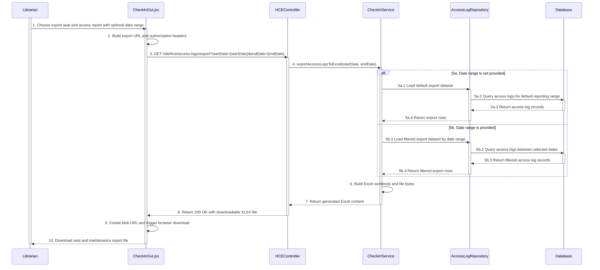

# FE-126 Export Seat & Maintenance Report

```mermaid
sequenceDiagram
    participant Librarian as Librarian
    participant CheckInOutPage as CheckInOut.jsx
    participant HCEApi as HCEController
    participant CheckInService as CheckInService
    participant AccessLogRepo as AccessLogRepository
    participant DB as Database

    activate Librarian
    Librarian->>CheckInOutPage: 1. Choose export seat and access report with optional date range
    activate CheckInOutPage
    CheckInOutPage->>CheckInOutPage: 2. Build export URL and authorization headers
    CheckInOutPage->>HCEApi: 3. GET /slib/hce/access-logs/export?startDate={startDate}&endDate={endDate}
    activate HCEApi
    HCEApi->>CheckInService: 4. exportAccessLogsToExcel(startDate, endDate)
    activate CheckInService
    alt 5a. Date range is not provided
        CheckInService->>AccessLogRepo: 5a.1 Load default export dataset
        activate AccessLogRepo
        AccessLogRepo->>DB: 5a.2 Query access logs for default reporting range
        activate DB
        DB-->>AccessLogRepo: 5a.3 Return access log records
        deactivate DB
        AccessLogRepo-->>CheckInService: 5a.4 Return export rows
        deactivate AccessLogRepo
    else 5b. Date range is provided
        CheckInService->>AccessLogRepo: 5b.1 Load filtered export dataset by date range
        activate AccessLogRepo
        AccessLogRepo->>DB: 5b.2 Query access logs between selected dates
        activate DB
        DB-->>AccessLogRepo: 5b.3 Return filtered access log records
        deactivate DB
        AccessLogRepo-->>CheckInService: 5b.4 Return filtered export rows
        deactivate AccessLogRepo
    end
    CheckInService->>CheckInService: 6. Build Excel workbook and file bytes
    CheckInService-->>HCEApi: 7. Return generated Excel content
    deactivate CheckInService
    HCEApi-->>CheckInOutPage: 8. Return 200 OK with downloadable XLSX file
    deactivate HCEApi
    CheckInOutPage->>CheckInOutPage: 9. Create blob URL and trigger browser download
    CheckInOutPage-->>Librarian: 10. Download seat and maintenance report file
    deactivate CheckInOutPage
    deactivate Librarian
```

