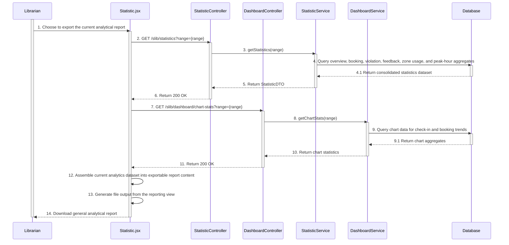

# FE-127 Export General Analytical Report

```mermaid
sequenceDiagram
    participant Librarian as Librarian
    participant StatisticPage as Statistic.jsx
    participant StatisticApi as StatisticController
    participant DashboardApi as DashboardController
    participant StatisticService as StatisticService
    participant DashboardService as DashboardService
    participant DB as Database

    activate Librarian
    Librarian->>StatisticPage: 1. Choose to export the current analytical report
    activate StatisticPage
    StatisticPage->>StatisticApi: 2. GET /slib/statistics?range={range}
    activate StatisticApi
    StatisticApi->>StatisticService: 3. getStatistics(range)
    activate StatisticService
    StatisticService->>DB: 4. Query overview, booking, violation, feedback, zone usage, and peak-hour aggregates
    activate DB
    DB-->>StatisticService: 4.1 Return consolidated statistics dataset
    deactivate DB
    StatisticService-->>StatisticApi: 5. Return StatisticDTO
    deactivate StatisticService
    StatisticApi-->>StatisticPage: 6. Return 200 OK
    deactivate StatisticApi
    StatisticPage->>DashboardApi: 7. GET /slib/dashboard/chart-stats?range={range}
    activate DashboardApi
    DashboardApi->>DashboardService: 8. getChartStats(range)
    activate DashboardService
    DashboardService->>DB: 9. Query chart data for check-in and booking trends
    activate DB
    DB-->>DashboardService: 9.1 Return chart aggregates
    deactivate DB
    DashboardService-->>DashboardApi: 10. Return chart statistics
    deactivate DashboardService
    DashboardApi-->>StatisticPage: 11. Return 200 OK
    deactivate DashboardApi
    StatisticPage->>StatisticPage: 12. Assemble current analytics dataset into exportable report content
    StatisticPage->>StatisticPage: 13. Generate file output from the reporting view
    StatisticPage-->>Librarian: 14. Download general analytical report
    deactivate StatisticPage
    deactivate Librarian
```
