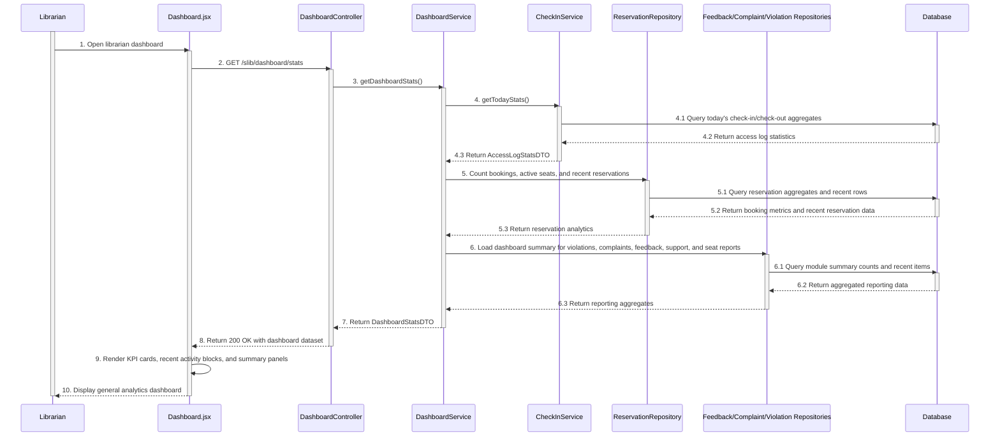

# FE-121 View General Analytics Dashboard

```mermaid
sequenceDiagram
    participant Librarian as Librarian
    participant DashboardPage as Dashboard.jsx
    participant DashboardApi as DashboardController
    participant DashboardService as DashboardService
    participant AccessService as CheckInService
    participant ReservationRepo as ReservationRepository
    participant ReportRepos as Feedback/Complaint/Violation Repositories
    participant DB as Database

    activate Librarian
    Librarian->>DashboardPage: 1. Open librarian dashboard
    activate DashboardPage
    DashboardPage->>DashboardApi: 2. GET /slib/dashboard/stats
    activate DashboardApi
    DashboardApi->>DashboardService: 3. getDashboardStats()
    activate DashboardService
    DashboardService->>AccessService: 4. getTodayStats()
    activate AccessService
    AccessService->>DB: 4.1 Query today's check-in/check-out aggregates
    activate DB
    DB-->>AccessService: 4.2 Return access log statistics
    deactivate DB
    AccessService-->>DashboardService: 4.3 Return AccessLogStatsDTO
    deactivate AccessService
    DashboardService->>ReservationRepo: 5. Count bookings, active seats, and recent reservations
    activate ReservationRepo
    ReservationRepo->>DB: 5.1 Query reservation aggregates and recent rows
    activate DB
    DB-->>ReservationRepo: 5.2 Return booking metrics and recent reservation data
    deactivate DB
    ReservationRepo-->>DashboardService: 5.3 Return reservation analytics
    deactivate ReservationRepo
    DashboardService->>ReportRepos: 6. Load dashboard summary for violations, complaints, feedback, support, and seat reports
    activate ReportRepos
    ReportRepos->>DB: 6.1 Query module summary counts and recent items
    activate DB
    DB-->>ReportRepos: 6.2 Return aggregated reporting data
    deactivate DB
    ReportRepos-->>DashboardService: 6.3 Return reporting aggregates
    deactivate ReportRepos
    DashboardService-->>DashboardApi: 7. Return DashboardStatsDTO
    deactivate DashboardService
    DashboardApi-->>DashboardPage: 8. Return 200 OK with dashboard dataset
    deactivate DashboardApi
    DashboardPage->>DashboardPage: 9. Render KPI cards, recent activity blocks, and summary panels
    DashboardPage-->>Librarian: 10. Display general analytics dashboard
    deactivate DashboardPage
    deactivate Librarian
```

