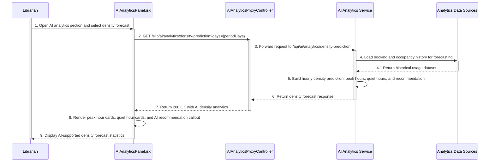

# FE-123 View Statistics of Density Forecast via AI

```mermaid
sequenceDiagram
    participant Librarian as Librarian
    participant AnalyticsPanel as AIAnalyticsPanel.jsx
    participant AnalyticsApi as AIAnalyticsProxyController
    participant AIService as AI Analytics Service
    participant DataStore as Analytics Data Sources

    activate Librarian
    Librarian->>AnalyticsPanel: 1. Open AI analytics section and select density forecast
    activate AnalyticsPanel
    AnalyticsPanel->>AnalyticsApi: 2. GET /slib/ai/analytics/density-prediction?days={periodDays}
    activate AnalyticsApi
    AnalyticsApi->>AIService: 3. Forward request to /api/ai/analytics/density-prediction
    activate AIService
    AIService->>DataStore: 4. Load booking and occupancy history for forecasting
    activate DataStore
    DataStore-->>AIService: 4.1 Return historical usage dataset
    deactivate DataStore
    AIService->>AIService: 5. Build hourly density prediction, peak hours, quiet hours, and recommendation
    AIService-->>AnalyticsApi: 6. Return density forecast response
    deactivate AIService
    AnalyticsApi-->>AnalyticsPanel: 7. Return 200 OK with AI density analytics
    deactivate AnalyticsApi
    AnalyticsPanel->>AnalyticsPanel: 8. Render peak hour cards, quiet hour cards, and AI recommendation callout
    AnalyticsPanel-->>Librarian: 9. Display AI-supported density forecast statistics
    deactivate AnalyticsPanel
    deactivate Librarian
```

