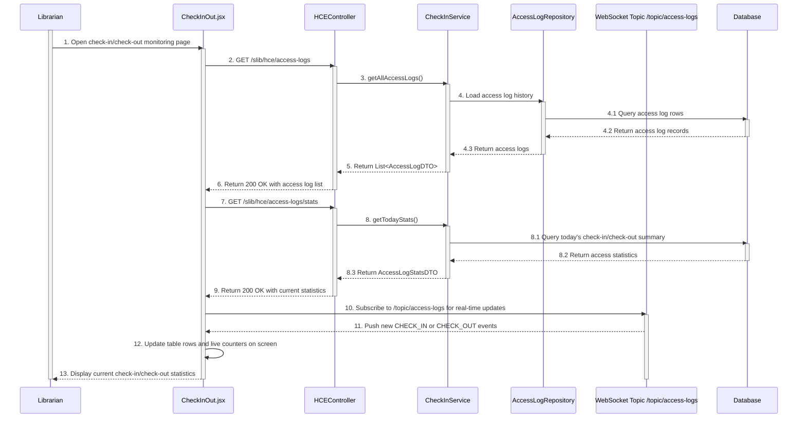

# FE-124 View Check-In Check-Out Statistics

```mermaid
sequenceDiagram
    participant Librarian as Librarian
    participant CheckInOutPage as CheckInOut.jsx
    participant HCEApi as HCEController
    participant CheckInService as CheckInService
    participant AccessLogRepo as AccessLogRepository
    participant WebSocket as WebSocket Topic /topic/access-logs
    participant DB as Database

    activate Librarian
    Librarian->>CheckInOutPage: 1. Open check-in/check-out monitoring page
    activate CheckInOutPage
    CheckInOutPage->>HCEApi: 2. GET /slib/hce/access-logs
    activate HCEApi
    HCEApi->>CheckInService: 3. getAllAccessLogs()
    activate CheckInService
    CheckInService->>AccessLogRepo: 4. Load access log history
    activate AccessLogRepo
    AccessLogRepo->>DB: 4.1 Query access log rows
    activate DB
    DB-->>AccessLogRepo: 4.2 Return access log records
    deactivate DB
    AccessLogRepo-->>CheckInService: 4.3 Return access logs
    deactivate AccessLogRepo
    CheckInService-->>HCEApi: 5. Return List<AccessLogDTO>
    deactivate CheckInService
    HCEApi-->>CheckInOutPage: 6. Return 200 OK with access log list
    deactivate HCEApi
    CheckInOutPage->>HCEApi: 7. GET /slib/hce/access-logs/stats
    activate HCEApi
    HCEApi->>CheckInService: 8. getTodayStats()
    activate CheckInService
    CheckInService->>DB: 8.1 Query today's check-in/check-out summary
    activate DB
    DB-->>CheckInService: 8.2 Return access statistics
    deactivate DB
    CheckInService-->>HCEApi: 8.3 Return AccessLogStatsDTO
    deactivate CheckInService
    HCEApi-->>CheckInOutPage: 9. Return 200 OK with current statistics
    deactivate HCEApi
    CheckInOutPage->>WebSocket: 10. Subscribe to /topic/access-logs for real-time updates
    activate WebSocket
    WebSocket-->>CheckInOutPage: 11. Push new CHECK_IN or CHECK_OUT events
    CheckInOutPage->>CheckInOutPage: 12. Update table rows and live counters on screen
    CheckInOutPage-->>Librarian: 13. Display current check-in/check-out statistics
    deactivate WebSocket
    deactivate CheckInOutPage
    deactivate Librarian
```

