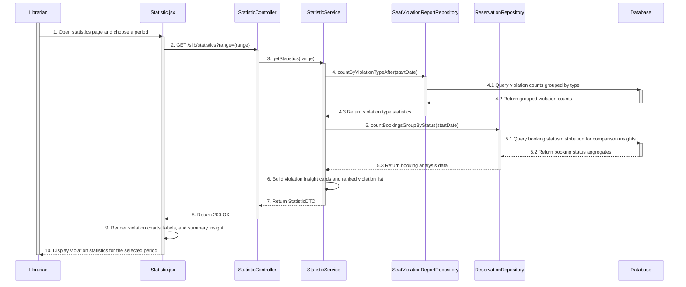

# FE-130 View Violation Statistics

```mermaid
sequenceDiagram
    participant Librarian as Librarian
    participant StatisticPage as Statistic.jsx
    participant StatisticApi as StatisticController
    participant StatisticService as StatisticService
    participant ViolationRepo as SeatViolationReportRepository
    participant BookingRepo as ReservationRepository
    participant DB as Database

    activate Librarian
    Librarian->>StatisticPage: 1. Open statistics page and choose a period
    activate StatisticPage
    StatisticPage->>StatisticApi: 2. GET /slib/statistics?range={range}
    activate StatisticApi
    StatisticApi->>StatisticService: 3. getStatistics(range)
    activate StatisticService
    StatisticService->>ViolationRepo: 4. countByViolationTypeAfter(startDate)
    activate ViolationRepo
    ViolationRepo->>DB: 4.1 Query violation counts grouped by type
    activate DB
    DB-->>ViolationRepo: 4.2 Return grouped violation counts
    deactivate DB
    ViolationRepo-->>StatisticService: 4.3 Return violation type statistics
    deactivate ViolationRepo
    StatisticService->>BookingRepo: 5. countBookingsGroupByStatus(startDate)
    activate BookingRepo
    BookingRepo->>DB: 5.1 Query booking status distribution for comparison insights
    activate DB
    DB-->>BookingRepo: 5.2 Return booking status aggregates
    deactivate DB
    BookingRepo-->>StatisticService: 5.3 Return booking analysis data
    deactivate BookingRepo
    StatisticService->>StatisticService: 6. Build violation insight cards and ranked violation list
    StatisticService-->>StatisticApi: 7. Return StatisticDTO
    deactivate StatisticService
    StatisticApi-->>StatisticPage: 8. Return 200 OK
    deactivate StatisticApi
    StatisticPage->>StatisticPage: 9. Render violation charts, labels, and summary insight
    StatisticPage-->>Librarian: 10. Display violation statistics for the selected period
    deactivate StatisticPage
    deactivate Librarian
```

