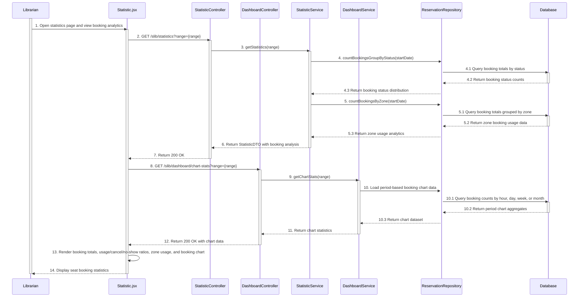

# FE-133 View Seat Booking Statistics

```mermaid
sequenceDiagram
    participant Librarian as Librarian
    participant StatisticPage as Statistic.jsx
    participant StatisticApi as StatisticController
    participant DashboardApi as DashboardController
    participant StatisticService as StatisticService
    participant DashboardService as DashboardService
    participant ReservationRepo as ReservationRepository
    participant DB as Database

    activate Librarian
    Librarian->>StatisticPage: 1. Open statistics page and view booking analytics
    activate StatisticPage
    StatisticPage->>StatisticApi: 2. GET /slib/statistics?range={range}
    activate StatisticApi
    StatisticApi->>StatisticService: 3. getStatistics(range)
    activate StatisticService
    StatisticService->>ReservationRepo: 4. countBookingsGroupByStatus(startDate)
    activate ReservationRepo
    ReservationRepo->>DB: 4.1 Query booking totals by status
    activate DB
    DB-->>ReservationRepo: 4.2 Return booking status counts
    deactivate DB
    ReservationRepo-->>StatisticService: 4.3 Return booking status distribution
    StatisticService->>ReservationRepo: 5. countBookingsByZone(startDate)
    ReservationRepo->>DB: 5.1 Query booking totals grouped by zone
    activate DB
    DB-->>ReservationRepo: 5.2 Return zone booking usage data
    deactivate DB
    ReservationRepo-->>StatisticService: 5.3 Return zone usage analytics
    StatisticService-->>StatisticApi: 6. Return StatisticDTO with booking analysis
    deactivate StatisticService
    StatisticApi-->>StatisticPage: 7. Return 200 OK
    deactivate StatisticApi
    StatisticPage->>DashboardApi: 8. GET /slib/dashboard/chart-stats?range={range}
    activate DashboardApi
    DashboardApi->>DashboardService: 9. getChartStats(range)
    activate DashboardService
    DashboardService->>ReservationRepo: 10. Load period-based booking chart data
    ReservationRepo->>DB: 10.1 Query booking counts by hour, day, week, or month
    activate DB
    DB-->>ReservationRepo: 10.2 Return period chart aggregates
    deactivate DB
    ReservationRepo-->>DashboardService: 10.3 Return chart dataset
    DashboardService-->>DashboardApi: 11. Return chart statistics
    deactivate DashboardService
    DashboardApi-->>StatisticPage: 12. Return 200 OK with chart data
    deactivate DashboardApi
    StatisticPage->>StatisticPage: 13. Render booking totals, usage/cancel/no-show ratios, zone usage, and booking chart
    StatisticPage-->>Librarian: 14. Display seat booking statistics
    deactivate StatisticPage
    deactivate Librarian
```

