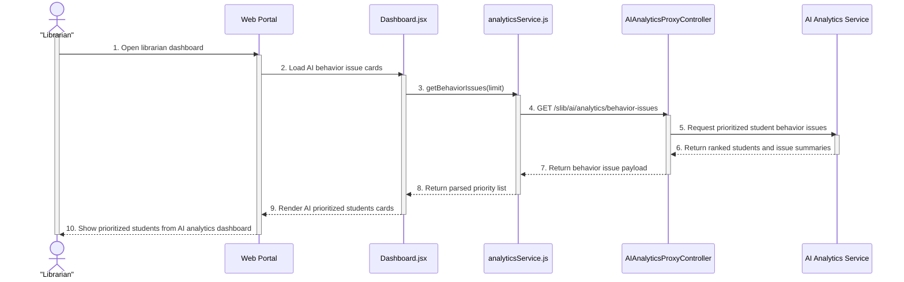

# FE-134 View AI Prioritized Students

```mermaid
sequenceDiagram
    actor Users as "Librarian"
    participant Client as Web Portal
    participant DashboardPage as Dashboard.jsx
    participant AnalyticsClient as analyticsService.js
    participant AIController as AIAnalyticsProxyController
    participant AIService as AI Analytics Service

    activate Users
    Users->>Client: 1. Open librarian dashboard
    activate Client
    
    Client->>DashboardPage: 2. Load AI behavior issue cards
    activate DashboardPage
    
    # Giai đoạn: Gọi Service xử lý Analytics
    DashboardPage->>AnalyticsClient: 3. getBehaviorIssues(limit)
    activate AnalyticsClient
    
    AnalyticsClient->>AIController: 4. GET /slib/ai/analytics/behavior-issues
    activate AIController
    
    # Bước 5 & 6: AI xử lý phân tích và xếp hạng
    AIController->>AIService: 5. Request prioritized student behavior issues
    activate AIService
    AIService-->>AIController: 6. Return ranked students and issue summaries
    deactivate AIService
    
    AIController-->>AnalyticsClient: 7. Return behavior issue payload
    deactivate AIController
    
    AnalyticsClient-->>DashboardPage: 8. Return parsed priority list
    deactivate AnalyticsClient
    
    # Giai đoạn: Hiển thị tại Dashboard
    DashboardPage-->>Client: 9. Render AI prioritized students cards
    deactivate DashboardPage
    
    Client-->>Users: 10. Show prioritized students from AI analytics dashboard
    
    deactivate Client
    deactivate Users
```
